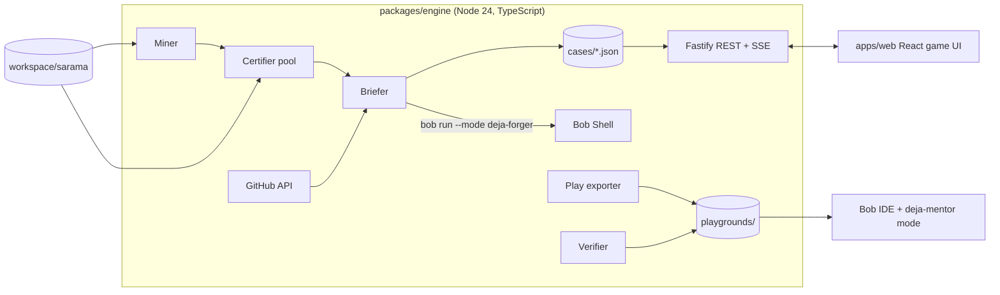

# DejaBug: Project Memory

> This file is the single source of truth for the project. Read it at the start of every session (human, Bob, or Claude). Update the **Status** and **Progress Log** sections at the end of every work session.

---

## 0. Status (update every session)

| Field | Value |
|---|---|
| Current tier | T1 Engine plan + Miner |
| Next item | T1.1 |
| Next owner | BOB |
| Last updated | 2026-09-26 00:10 BST |
| Bobcoins used | 0 / 40 |
| Blockers | watsonx account activation (requested). Bob IDE is logged in. |

---

## 1. Hackathon facts

- **Event:** IBM Bob 2.0 Hackathon (lablab.ai), online.
- **Hard deadline:** Sun Sep 27 2026, **8:00 PM BST** (10 AM ET, per the IBM account page. lablab shows 9:00 PM, and we plan for the earlier one). The watsonx cloud account closes at the same moment.
- **Our budget:** 40 hours = **35 h development** (Fri 11 PM to Sun 10 AM) + **5 h submission** (Sun 10 AM to 3 PM). Everything after that is buffer.
- **Team:** ahammadshawki8.
- **Repository:** https://github.com/ahammadshawki8/DejaBug (public, MIT).
- **Judging:** Application of Technology, Presentation, Business Value, Originality.
- **Hard requirements** (missing any one of these can disqualify us):
  - Bob IDE is a core part of the solution.
  - `bob_sessions/` contains PNG task-summary screenshots from each member.
  - Problem & Solution statement and Bob Usage statement are each 500 words or less.
  - Video is MP4, 3:00 or less, with at least 90 s of the product working and narration.
  - Repo is public with an MIT license.
  - No personal, client, confidential, or social-media data. Every public source is listed in `docs/DATA_SOURCES.md`.
- **Pre-submit check:** `node scripts/check-submission.mjs` and `node scripts/check-style.mjs`.

---

## 2. Rules (must be followed for the whole project)

1. **Commit identity.** Every commit is authored and committed by `ahammadshawki8`, and nobody else. Never add `Co-Authored-By` trailers, and never list Claude, Bob, srotdev, or any bot as author, committer, collaborator, or contributor. Bob's generated commit messages must be checked for trailers before committing. Before every push, run `git log --format='%an <%ae> | %cn <%ce>%n%b' origin/main..HEAD` and confirm.
2. **No emojis and no em dashes (U+2014)** anywhere in the project: code, comments, docs, UI text, commit messages, slides. Use a plain hyphen or a colon instead. `scripts/check-style.mjs` enforces this.
3. **No personal information in case data.** GitHub usernames, emails, and avatars from issues and PRs are never stored or shown. Store only counts, durations, and redacted text.
4. **Ownership is explicit.** Every checklist item is tagged [BOB], [CLAUDE] (Claude Code or Codex), or [HUMAN]. Agents only do their own items and hand off with the protocol in Section 9.3.
5. **One [BOB] item per Bob task.** Each Bob task gets a PNG summary screenshot saved to `bob_sessions/` as soon as it finishes.
6. **Keep this file current.** Tick checklist boxes, update Status, and append to the Progress Log after each work session.
7. **Secrets** (GitHub token, API keys) live only in `.env`, never in git. `.env.example` documents them.
8. **Working software over breadth.** A tier is done only when its "Done when" line is demonstrably true. Never start the next tier with the current one broken.
9. **The frontend must feel like a game**, not an admin panel (see Section 6).

---

## 3. The pitch

**One-liner:** *Pilots train on replays of real incidents. Your new hires train on your team's real bugs.*

**Problem.**
- New engineers take months to become productive, and 67% say their first production-ready contribution took over 4 weeks.
- AI assistants make it worse for the skill that matters most. In Anthropic's 2026 randomized study, developers who learned with AI scored 17% lower on mastery, and **the largest gap was debugging**. Developers who used AI to understand, not to produce, kept their learning.
- Meanwhile every repository holds a perfect, unused curriculum: hundreds of real bugs, each with a known fix and a test that proves it.

**Solution.** DejaBug mines a repository's history for real bug fixes and turns each one into a **certified training case**:
1. Restore the code as it was just before the fix.
2. Add the fix's own test.
3. Prove that the test fails on the buggy code and passes on the real fix.

Bob turns each fix's PR and issue thread into a spoiler-free case file. The new hire then debugs the real bug in Bob IDE, coached by a **read-only Bob Mentor mode that physically cannot write the fix**. They earn XP, ranks, and badges. At the end they get a debrief comparing their fix and time with the original team's.

**Demo repository:** [IBM/sarama](https://github.com/IBM/sarama), a Go client for Apache Kafka (12.5k stars, MIT license).
- Measured on 2026-09-25: 2,889 commits. 822 are fix-like. **174 change both tests and 3 or fewer source files** (the candidate pool).
- Go modules make historical snapshots build reliably.

**Why it wins:**
- **Originality:** SWE-bench-style replay is used to benchmark AI models. We point it at onboarding humans, and we found no existing product that does this.
- **Proof:** every case is verified fail-then-pass, so nothing is guessed.
- **Bob-native:** parallel case forging, subagents, document understanding of PR and issue threads, a custom mode with restricted permissions, and Bob Shell headless runs inside the pipeline.

---

## 4. Features

### 4.1 Engine (CLI + local server)
- **F1 Mine.** Scan `git log` for fix-like commits. Keep those that change `_test.go` files plus 1 to 3 source files. Record the PR number from the commit message. Output a candidate list with metadata.
- **F2 Certify.** For each candidate, in parallel isolated worktrees:
  1. Check out the parent commit.
  2. Overlay the fix commit's test files.
  3. Detect which test functions were added or changed.
  4. Run them 3 times. They must **fail** every time with a test failure, not a build failure.
  5. Overlay the fix's source files and run again. They must **pass**.

  Each candidate gets one status: `certified`, `rejected:build`, `rejected:no-fail`, `rejected:flaky`, `rejected:no-pass`, or `rejected:timeout`. The funnel counts are persisted.
- **F3 Brief (Bob).** For each certified case, fetch the PR and linked issue text through the GitHub REST API. Then call `bob run --format json --mode deja-forger` to produce a case file:
  - codename
  - symptom report written like a user report
  - evidence snippet
  - 3 tiered hints (nudge, direction, near-answer)
  - difficulty 1 to 3
  - precinct (code area)
  - lesson learned
  - tags

  The output is validated with a schema, with one retry.
- **F4 Spoiler guard.** Reject or regenerate any brief that contains identifiers or literals introduced by the fix diff.
- **F5 Original effort.** From the GitHub API: time from issue opened to PR merged, comment count, and review rounds. Counts only, no usernames.
- **F6 Play export.** `dejabug start <case>` exports a clean playground:
  - It contains the snapshot at the parent commit plus the fix's tests, as a fresh git repo with **no future history**, so the answer can't be peeked at.
  - It includes an `AGENTS.md` telling Bob this is a training case, and the `deja-mentor` mode.
- **F7 Verify.** Run the case's tests in the playground and return pass/fail with the parsed failing test names and output.
- **F8 Reveal.** Return the original fix diff, the player's diff, the lesson, and the original-effort stats.
- **F9 Local server.** A REST API plus SSE progress events for forge runs. It serves the web app.

### 4.2 Web app (gamified)
- **W1 Case Board.** A detective cork board of case cards: codename, difficulty stars, precinct, "cold for N days" (age of the bug), and a locked/solved state.
- **W2 Case File.** The symptom report, evidence, precinct, par time, and a "Take the case" button that exports the playground and shows its path.
- **W3 Investigation screen.** A live timer, a hint ladder (each hint costs XP and needs a confirmation), a "Run the tests" button with animated pass/fail, and an "Ask the Mentor" panel explaining how to open the case in Bob IDE with Deja Mentor mode.
- **W4 Debrief.** A case-closed stamp animation, "You: 11m 32s, 1 hint" against "Original team: 3 days, 41 comments", a side-by-side diff (yours vs theirs), the lesson learned, and XP gained.
- **W5 Progression.** XP, ranks (Rookie, Detective, Inspector, Chief Inspector, Commissioner), badges, streak, and a mastery ring per precinct.
- **W6 Forge Console.** A live view of the pipeline: parallel worker lanes, each candidate moving through mine, certify, and brief with a status, plus an animated funnel (822 fix commits, 174 candidates, N certified). This is the "Application of Technology" moment in the video.
- **W7 Showcase mode.** A static build deployed publicly with bundled, pre-forged cases. Verification results in showcase mode are replays of real recorded local runs and are labeled as such.

### 4.3 Bob-native pieces (shipped in the repo)
- **B1** `.bob/custom_modes.yaml`: `deja-forger` (read-only, writes case JSON only) and `deja-mentor` (read-only: can read code and run nothing, Socratic, never writes the fix).
- **B2** `.bob/skills/forge-case/SKILL.md`: instructions and the JSON schema for writing a spoiler-free case file.
- **B3** `.bob/skills/mentor/SKILL.md`: the coaching method (ask, point, never patch).
- **B4** The playground `AGENTS.md` template that tells Bob it is inside a training case.

---

## 5. Architecture



**Stack**
- Engine: Node 24, TypeScript, `tsx`, `commander`, `execa`, `fastify`, `zod`, `p-limit`, `vitest`.
- Web: Vite, React 18, TypeScript, Tailwind CSS, Framer Motion, Zustand, `pixelarticons`, `@fontsource/*` (Silkscreen, Special Elite, IBM Plex Sans/Mono), `canvas-confetti`, `diff2html` for diffs, WebAudio sound effects. Full visual spec: Section 6A.
- Target toolchain: Go 1.22 or later (for sarama tests).
- Monorepo: npm workspaces.

**Directory layout**
```
DejaBug/
  PROJECT.md  AGENTS.md  README.md  LICENSE
  .bob/  custom_modes.yaml  rules/  skills/
  packages/engine/src/  miner.ts certifier.ts briefer.ts spoiler.ts github.ts
                        play.ts verify.ts server.ts cli.ts store.ts types.ts
  apps/web/src/         pages/ components/ game/ api/ sounds/
  cases/sarama/         <sha>.json (committed, pre-forged)  funnel.json
  workspace/            (gitignored) sarama clone, worktrees
  playgrounds/          (gitignored) exported cases
  docs/  reviews/ submission/ DATA_SOURCES.md DECISIONS.md BOB_USAGE_LOG.md
  bob_sessions/  scripts/
```

**Case JSON (contract between engine and web)**
```ts
type Case = {
  id: string;              // short sha of fix commit
  repo: "IBM/sarama";
  fixSha: string; parentSha: string; prNumber?: number;
  status: "certified";
  tests: string[];         // Go test names
  packages: string[];      // go packages to test
  certification: { failRuns: number; passRuns: number; failOutput: string; passOutput: string; durationMs: number };
  brief: { codename: string; symptoms: string; evidence: string; hints: [string, string, string];
           difficulty: 1 | 2 | 3; precinct: string; lesson: string; tags: string[] };
  original: { daysOpen?: number; comments?: number; reviewRounds?: number; mergedAt: string };
  bugAgeDays: number;      // commit date of fix minus date the buggy code was introduced (approx)
  parSeconds: number;
  fixDiff: string;         // revealed only in debrief
};
```

**REST API**
- `GET /api/cases`
- `GET /api/cases/:id` (no fixDiff)
- `POST /api/cases/:id/start`
- `POST /api/cases/:id/verify`
- `POST /api/cases/:id/hint/:n`
- `GET /api/cases/:id/reveal` (only after a pass, or after giving up)
- `GET /api/funnel`
- `POST /api/forge` + `GET /api/forge/events` (SSE)
- `GET/PUT /api/profile`

**Key decisions** (details in `docs/DECISIONS.md`):
- The playground is exported with `git archive` into a fresh repo, so there is no future history and no answer peeking.
- Cases are pre-forged and committed, so the demo is deterministic and live runs spend no Bobcoins.
- A certified case needs 3 of 3 failing runs, which rejects flaky race tests.

---

## 6. Game design

- **Theme:** a cold-case detective agency. Palette: dark navy, case-file manila, stamp red, neon amber accents. Typewriter font for briefs, bold display font for headings.
- **Core loop:** pick a case, read the file, investigate in Bob IDE, run the tests, close the case, then debrief and earn XP. This unlocks harder cases.
- **XP:** base 100 / 200 / 300 by difficulty. Each hint costs 25% of base. A time bonus of up to +50% applies when under par. A no-hint solve gets a x1.2 multiplier.
- **Ranks:** Rookie 0, Detective 300, Inspector 900, Chief Inspector 2000, Commissioner 4000.
- **Badges:**
  - Cold Case Closed (first solve)
  - Clean Hands (no hints)
  - Beat the Clock (under par)
  - Race Hunter (concurrency tag)
  - Protocol Whisperer (3 protocol cases)
  - Precinct Master (all cases in one precinct)
  - Faster Than The Original (solve time under 1% of the original fix time)
- **Feel:** stamp and paper-slide animations, a typewriter reveal of the symptoms, a red/green terminal for test runs, confetti plus a CASE CLOSED stamp on success, and subtle sound effects with a mute toggle.
- **Accessibility:** keyboard navigable, sufficient contrast, and `prefers-reduced-motion` respected.

---

## 6A. Frontend design directive (binding for T5-T7)

Read this section, Section 4.2, and Section 6 before designing or changing any screen. If this section conflicts with a default habit, this section wins. Do not redesign functionality. Design the presentation and interaction around the functionality described in this file.

**The 3-second test:** someone seeing any screen for 3 seconds should think "developer debugging game / detective investigation", not "project-management dashboard".

### 6A.1 What we take from the reference screenshots (and what we do not)
- References live in `screenshots_inspired/`. They are local only, gitignored, and never shipped (third-party designs).
- **Take:**
  - thick dark outlines (3 px) with **hard offset shadows** (no blur)
  - flat, saturated color blocks
  - pixel-art icons
  - a ribbon-banner page title with an arrow tail
  - chunky stat tiles
  - a bold colored header bar on data blocks
  - pixel-bordered progress bars with the value printed inside
  - collectible cards for achievements
  - an arcade-style pop-up modal (the leaderboard)
  - a persistent left icon rail whose active item is a solid color block
  - dense but clean information blocks
- **Do not take:** their purple/yellow/blue palette, their layout, the "workspace/task manager" framing, generic bar charts, or photo avatars.

### 6A.2 Principles
- **Design, do not default.** No typical SaaS/admin dashboard, generic card grids, gradients, glassmorphism, shadcn or Material look, or large border radii. It is a game interface first and a developer tool second.
- **Tactile.** The UI is built from physical detective objects, stylized and clean, never photorealistic:
  - manila case folders and dossier tabs
  - evidence sheets and clipped notes
  - cork-board case cards with pins, and string where it carries meaning
  - stamped documents and police-file labels
  - terminal readouts
  - worn paper edges
- **Hierarchy through color.** Dark navy is the environment. Manila and off-white are case-file surfaces. Stamp red means danger, failure, or a key action. Neon amber means interactive, highlight, or XP. Restrained green is only for verified/pass states. No rainbow colors.
- **Dense but clean.** Strong borders, deliberate spacing, compact information blocks, and large focal elements. No giant empty areas and no marketing-site hero typography.
- **Every decoration has a gameplay purpose.** No stock illustrations, no emoji icons, no decorative noise.
- **Progression is always visible** (rank, XP, streak live in the shell) and is never reduced to plain text statistics.

### 6A.3 Design tokens (define once in `tailwind.config.ts` and `src/styles/tokens.css`; never hardcode hex values in components)

| Token | Value | Use |
|---|---|---|
| `ink` | `#0B1426` | App background (navy environment) |
| `navy` | `#14223F` | Rail, dark panels, terminal frame |
| `navy-2` | `#1E3159` | Raised dark surfaces, hover |
| `line` | `#05080F` | All outlines and hard shadows |
| `manila` | `#E8D49B` | Case folders, cards |
| `paper` | `#F7F1E1` | Documents, evidence sheets, dossier pages |
| `cork` | `#B98A5A` | Case board surface (CSS pattern, no images) |
| `stamp` | `#D7263D` | Fail, danger, primary irreversible actions, CASE CLOSED |
| `amber` | `#FFB627` | Interactive highlight, XP, active nav, focus ring |
| `pass` | `#2FA84F` | Verified, tests passing |
| `muted` | `#8A93A6` | Secondary text on dark |
| `text-dark` | `#1A1A1A` | Text on paper/manila |

- **Outline:** `3px solid line`. **Shadow:** `4px 4px 0 line` (hard, no blur). **Pressed:** translate `2px 2px` and shadow `2px 2px 0 line`. **Radius:** 2 px (4 px max). Contrast must reach WCAG AA on every surface.

### 6A.4 Typography (self-hosted via `@fontsource/*` so the demo works offline)
- **Display / headings / labels:** `Silkscreen` (pixel). Use it for short strings only: page ribbons, codenames, stamps, button labels, stat labels.
- **Case reports and evidence:** `Special Elite` (typewriter).
- **Body and UI text:** `IBM Plex Sans`.
- **Numbers, timer, terminal, code:** `IBM Plex Mono` (tabular numerals).
- **Never** set paragraphs in the pixel font. Body copy stays 15 to 16 px and highly legible.

### 6A.5 Icons and art
- UI icons come from `pixelarticons` (MIT) as React components. Never use emoji.
- Rank insignias (5), badge art (7), precinct seals, the cork pin, the stamp, and the paper clip are **custom pixel SVGs** drawn on a 16x16 or 32x32 grid and kept in `apps/web/src/art/`.

### 6A.6 Game shell (every screen)
- **Left rail (80 px, navy):** Case Board (board icon), Investigation (magnifier), Forge (hammer/zap), Progress (trophy), and Settings (sliders) at the bottom. The active item is a solid amber block with an ink icon, as in the references. Tooltips appear on hover and focus.
- **Top bar:**
  - a ribbon-banner page title in stamp red with an arrow tail
  - on the right: rank insignia, a compact XP bar ("1,240 / 2,000 XP"), streak counter, mute toggle, and an engine status light (green = engine connected, amber = showcase mode)
- **Dispatch ticker** (thin line above the ribbon, like the references' "quote of the day"): rotating one-line lessons from solved cases, which gives the ticker a teaching purpose.

### 6A.7 Screens
**Case Board (the hero, W1).**
- The board is a cork surface (CSS pattern), not a table or card grid.
- Cases are pinned manila folders in a loose grid with slight random rotation (-2 to 2 degrees, seeded by case id so it is stable).
- Above the board, a strip of chunky stat tiles: Open cases, Closed, Best time, Current rank.
- Precinct filters are dossier tabs: All, Producer, Consumer, Protocol, Client, Admin.
- Each folder shows:
  - codename in the pixel font
  - precinct on the folder tab
  - difficulty as 1 to 3 magnifier pips
  - "COLD FOR 1,204 DAYS" as a stamped label
  - reward chip "+300 XP" in amber
- Four distinct states:
  - **Locked:** desaturated, padlock, diagonal "LOCKED: REACH DETECTIVE" tape.
  - **Available:** manila, lifts on hover.
  - **Active:** amber outline, pulsing pin, "IN PROGRESS" clip.
  - **Solved:** red CASE CLOSED stamp overlay, best time shown.
- On hover, a red string links cases in the same precinct.

**Case File (W2).**
- Opening a case plays a folder-opening transition into a two-page dossier.
- **Left page:** the symptom report revealed with a typewriter animation (click or press Space to finish instantly), then an evidence sheet with a paper clip holding a terminal readout of the redacted failing test output.
- **Right page:** "MISSION PARAMETERS" as game information, not form fields: precinct seal, difficulty pips, par time, reward, tests to pass, and bug age.
- **TAKE THE CASE** is a large stamp-red button. After it is pressed, it shows the playground path with a copy button and three steps: open in Bob IDE, switch to Deja Mentor mode, investigate.

**Investigation (W3).**
- The focal elements are:
  - a huge live timer in Plex Mono, with a par marker that turns stamp red when exceeded
  - the current objective ("Make TestProducerRetry pass")
  - a remaining-XP meter that visibly drains with time and hints
- **Hint ladder:** 3 sealed envelopes stacked vertically, each labeled with its cost ("-75 XP"). Opening one needs a confirmation. An opened hint becomes a clipped note.
- **RUN TESTS** is a major arcade button: amber, deep press animation, shortcut `R`.
- **Fail sequence:** the terminal types red lines, the status reads "SUSPECT STILL AT LARGE", and there is a short shake (skipped under reduced motion).
- **Pass sequence:** green "VERIFIED" lines, then an automatic transition to the Debrief.
- A small, secondary "Give up and reveal" action awards 0 XP.

**Debrief (W4).**
- The CASE CLOSED stamp slams in (scale 2 to 1, rotate -8 degrees, about 220 ms, one-frame screen jolt).
- The XP counter rolls up, then time and hints used appear.
- Newly unlocked badges flip in as collectible cards.
- The rank bar fills, and the rank-up modal appears if a threshold is crossed.
- Then a fighting-game style **VS panel**, "YOUR INVESTIGATION vs ORIGINAL TEAM":
  - left: your time, hints, lines changed
  - right: days open, comments, review rounds
- Then the side-by-side diff (diff2html restyled to the tokens) and the lesson on an index card.
- Actions: Share card (PNG), Next case.
- Confetti fires only on rank-up or the first solve.

**Progress (W5).**
- A large rank insignia and a rank ladder path with 5 nodes, Rookie -> Detective -> Inspector -> Chief Inspector -> Commissioner.
- The XP bar with the next rank.
- A badge collection of collectible cards, with locked badges shown as silhouettes with their unlock hint.
- Precinct mastery as segmented pixel rings.
- A streak calendar of pixel squares, and closed cases as a file drawer list.
- An arcade leaderboard modal inspired by the reference. It shows local player profiles only, never real names from GitHub.

**Forge Console (W6, key demo moment).**
- **Funnel:** three large counters connected by arrows, FIX COMMITS 822 -> CANDIDATES 174 -> CERTIFIED N. Each ticks up as events arrive.
- **Worker lanes:** 4 to 8 horizontal conveyor belts. Each lane shows its current candidate chip (short sha + commit subject) moving through three stations: MINE, CERTIFY (with fail-run lights 1/2/3 and a pass light), and BRIEF (with a "Bob is writing" indicator).
- **Outcomes:** certified cases drop into an "Evidence Locker" tray on the right as new folders. Rejected candidates fall into a discard bin with a reason tag (build, flaky, no-fail).
- **Controls:** a terminal log ticker along the bottom, a "Forge 8 cases" button, and a concurrency selector.
- It must read as parallel activity instantly, even to someone who does not know the implementation.

**Settings.** Sound on/off and volume, a reduced-motion override, reset profile (with confirmation), engine connection details, and a showcase-mode notice.

**States everywhere, all themed:**
- **Loading:** paper sliding in.
- **Empty board:** "No open cases. Fire up the Forge."
- **Engine offline:** "Radio silence from HQ", with a retry button.
- **Errors:** a stamped memo with the message and a retry button.

### 6A.8 Motion (Framer Motion)
- UI feedback takes 120 to 200 ms. Paper slides take 300 to 400 ms. The stamp impact takes about 220 ms with a slight overshoot. Counters and progress fills take 500 to 700 ms.
- Animations never block input, and repeated actions are never slowed down.
- Micro-interactions:
  - buttons depress 2 px
  - folders lift 2 to 4 px on hover
  - stamps hit with weight
  - XP counts upward
  - progress fills smoothly
  - newly unlocked items get a brief amber highlight
- Under `prefers-reduced-motion` or the Settings override, everything becomes an opacity fade: no shake, no rotation, no confetti.

### 6A.9 Sound (WebAudio, synthesized, no audio files)
- Sounds: click (short square blip), stamp (low noise thump), fail (descending buzz), pass (ascending 3-note arpeggio), rank-up (4-note fanfare).
- Master gain 0.3. Starts after the first user gesture. The mute state persists, and the mute toggle is always visible in the top bar.

### 6A.10 Component inventory (`apps/web/src/components/game/`)
- **Shell:** `GameShell`, `NavRail`, `RibbonTitle`, `DispatchTicker`.
- **Surfaces:** `StatTile`, `PaperPanel`, `DarkPanel`, `DossierTabs`, `Modal` (arcade), `Toast` (clipped note), `Tooltip`.
- **Cases:** `CaseFolder`, `Stamp`, `TypewriterText`, `Terminal`.
- **Controls:** `ArcadeButton`, `IconButton`.
- **Progression:** `XpBar`, `RankInsignia`, `BadgeCard`, `MasteryRing`, `StreakCalendar`.
- **Investigation:** `HintLadder`, `Timer`, `VersusPanel`.
- **Forge:** `WorkerLane`, `FunnelCounter`.

Every screen is composed from these. No page-specific one-off styling.

### 6A.11 Stack and rules
- React 18, TypeScript, Tailwind CSS, Framer Motion, Zustand, `pixelarticons`, `@fontsource/*`, `canvas-confetti`, `diff2html`.
- No emojis and no em dashes in UI text or source. Use icon components.
- Accessibility:
  - full keyboard navigation (`R` runs tests, `H` opens the next hint, `Esc` closes modals)
  - visible amber focus rings
  - AA contrast
  - `aria-live` announcements for test results and XP gains
  - reduced motion respected

### 6A.12 Procedure for Bob (before editing frontend code)
1. Inspect the existing `apps/web` structure.
2. Read Sections 4.2, 6, and 6A.
3. Define or extend the tokens and the shared components first.
4. State briefly what you intend to change.
5. Implement consistently across the affected screens.
6. Check the 3-second test and the states list before declaring done.

## 7. Implementation checklist (tier by tier)

Hour estimates add up to 35. "M" marks a milestone that triggers a Claude review.

**Every item has an ID and exactly one owner:**
- **[BOB]:** done by IBM Bob, one item per Bob task (Section 9). These are the judged, visible, Bob-native parts.
- **[CLAUDE]:** done by Claude Code or Codex. This is the plumbing.
- **[HUMAN]:** done by you: an account, a command to run, a screenshot, or a decision.

Work always proceeds top to bottom. Follow the handoff protocol in Section 9.3.

### T0 Setup (1 h), target Fri 11:59 PM
- [x] T0.1 [HUMAN] Install Go (`winget install GoLang.Go`) and verify `go version`. Installed go1.27.0.
- [x] T0.2 [HUMAN] Clone IBM/sarama into `workspace/sarama` (gitignored). `go test -run TestAsyncProducer -count=1 .` passes: about 30 s the first time, about 1 s after.
- [x] T0.3 [CLAUDE] Scaffold npm workspaces `packages/engine` and `apps/web`: shared tsconfig, eslint, prettier, vitest, and the dev scripts (`npm run dev`, `build`, `test`, `lint`, `typecheck`).
- [x] T0.4 [CLAUDE] `.env.example` with `GITHUB_TOKEN`, `DEJABUG_REPO_DIR`, `LLM_PROVIDER` (`watsonx` or `bob`), `WATSONX_API_KEY`, `WATSONX_PROJECT_ID`, `WATSONX_URL`, `WATSONX_MODEL_ID`, `BOB_MAX_COST`.
- [x] T0.5 [CLAUDE] GitHub Actions CI: lint, typecheck, unit tests, `check-style.mjs`.
- [ ] **Done when:** `npm run build && npm test` passes locally and on CI.

### T1 Engine plan + Miner (2 h), target Sat 2:00 AM
- [ ] T1.1 [BOB] **Plan mode task:** design the engine modules (miner, certifier, briefer, spoiler, play, verify, server) against Sections 4.1 and 5. Save the plan as `docs/ENGINE_PLAN.md`. This is cheap, and it is our "Plan mode" evidence.
- [ ] T1.2 [CLAUDE] `miner.ts`: fix-like commit filter, file classification, PR number extraction, changed test function detection, and the `dejabug mine` CLI command.
- [ ] T1.3 [CLAUDE] Miner unit tests on a fixture git repo.
- [ ] **Done when:** `dejabug mine --repo workspace/sarama --out cases/sarama/candidates.json` outputs 150 or more candidates in under 30 s.

### T2 Certifier (4 h), target Sat 6:00 AM, **M1**
- [ ] T2.1 [BOB] `certifier.ts` core: worktree lifecycle, test overlay from the fix commit, go test runner with timeout, output parsing (build failure vs test failure), the 3-run fail rule and 1-run pass rule, and every rejection status.
- [ ] T2.2 [BOB] Parallel certification pool (default concurrency 4) with a typed progress event emitter. This is our "parallel" evidence.
- [ ] T2.3 [CLAUDE] `funnel.json` writer, the `dejabug certify --limit N` CLI command, and certifier unit tests.
- [ ] T2.4 [HUMAN] Run `dejabug certify --limit 40` and commit the results.
- [ ] T2.5 [CLAUDE] **Review #1:** write `docs/reviews/REVIEW-01.md`, with each item tagged [BOB] or [CLAUDE] by the file it touches. No code changes.
- [ ] T2.6 [BOB] Apply the [BOB] items of REVIEW-01 in one task.
- [ ] T2.7 [CLAUDE] Apply the [CLAUDE] items of REVIEW-01.
- [ ] **Done when:** 12 or more certified sarama cases exist with recorded fail and pass output.

### T3 Briefs (3 h), target Sat 9:00 AM
- [ ] T3.1 [CLAUDE] `github.ts`: PR, linked issue, and comments fetch with an ETag cache and username/email/avatar stripping. Original-effort stats (days open, comments, review rounds).
- [ ] T3.2 [CLAUDE] `llm/watsonx.ts`: a watsonx.ai text-generation client (IAM token exchange, Granite model from `WATSONX_MODEL_ID`, JSON output). Never use the models the hackathon bans (Section 9.8).
- [ ] T3.3 [BOB] **The forger:**
  - the `deja-forger` custom mode in `.bob/custom_modes.yaml`
  - `.bob/skills/forge-case/SKILL.md` (brief schema, spoiler rules, hint ladder method)
  - `briefer.ts`: prompt built from the skill, provider switch (`watsonx` for batch, `bob` = `bob run --format json --mode deja-forger --max-cost`), zod validation, one retry
- [ ] T3.4 [BOB] **Subagent task:** "Use explore subagents in parallel to inspect the certified cases and rank them by teaching value and difficulty; write `cases/sarama/ranking.json`." This is our "subagents" evidence.
- [ ] T3.5 [CLAUDE] `spoiler.ts`: extract identifiers and literals from the fix's added lines and reject briefs that contain them. Includes tests.
- [ ] T3.6 [HUMAN] Generate briefs: Granite for all certified cases, plus `LLM_PROVIDER=bob` for 2 or 3 showcase cases. Commit the case JSON.
- [ ] **Done when:** 12 or more cases have valid, spoiler-free briefs in `cases/sarama/`.

### T4 Game server + play/verify (3 h), target Sat 12:00 PM
- [ ] T4.1 [CLAUDE] `play.ts`: `git archive` export, test overlay, fresh `git init`, the playground `AGENTS.md` template, and a copy of the `deja-mentor` mode.
- [ ] T4.2 [CLAUDE] `verify.ts`: run the case's tests in the playground and parse the results.
- [ ] T4.3 [CLAUDE] `server.ts`: all REST endpoints plus SSE forge events (Section 5). Reveal stays locked until a pass or a give-up.
- [ ] **Done when:** an end-to-end run through curl works: start, apply the real fix by hand, verify passes, reveal works.

### T5 Web core (6 h), target Sat 6:00 PM, **M2**
- [ ] T5.1 [CLAUDE] Web app scaffold: Vite + React + Tailwind + Framer Motion + Zustand, routing, the typed API client, and the game state store.
- [ ] T5.2 [BOB] **Design system:** tokens, fonts, icons, custom pixel art, and the full component inventory (6A.3-6A.5, 6A.10), shown on a `/styleguide` route.
- [ ] T5.3 [CLAUDE] Game shell (6A.6) built from the Bob components.
- [ ] T5.4 [BOB] **Case Board**, the hero screen (6A.7 W1).
- [ ] T5.5 [CLAUDE] Case File dossier (6A.7 W2).
- [ ] T5.6 [BOB] **Investigation + Debrief**, the core game loop (6A.7 W3 and W4).
- [ ] T5.7 [CLAUDE] Themed loading, empty, and error states, keyboard shortcuts, and reduced motion (6A.7, 6A.8, 6A.11).
- [ ] T5.8 [CLAUDE] **Review #2:** write `docs/reviews/REVIEW-02.md` with tagged items.
- [ ] T5.9 [BOB] Apply the [BOB] items of REVIEW-02.
- [ ] T5.10 [CLAUDE] Apply the [CLAUDE] items of REVIEW-02.
- [ ] **Done when:** a full case can be played in the browser against the local engine, and the screens pass the 3-second test.

### T6 Gamification (4 h), target Sat 10:00 PM
- [ ] T6.1 [CLAUDE] XP engine with unit tests, ranks, badges, streak, precinct mastery, and a persisted profile (Section 6 rules).
- [ ] T6.2 [CLAUDE] Progress screen (6A.7 W5), rank-up modal, arcade leaderboard modal, and WebAudio sounds with mute (6A.9).
- [ ] T6.3 [CLAUDE] A shareable "Case Closed" card (PNG export).
- [ ] **Done when:** solving a case visibly awards XP and badges, and a rank-up can be triggered.

### T7 Forge Console (3 h), target Sun 1:00 AM
- [ ] T7.1 [BOB] **Forge Console** as specified in 6A.7 W6: SSE-driven worker lanes, funnel counters, the Evidence Locker, and the discard bin with reasons. This is the key demo moment.
- [ ] **Done when:** clicking "Forge 8 cases" shows the lanes moving in real time against sarama.

### T8 Mentor (2 h), target Sun 3:00 AM
- [ ] T8.1 [BOB] `deja-mentor` mode (groups: read only) and `.bob/skills/mentor/SKILL.md` (ask, point, never patch).
- [ ] T8.2 [CLAUDE] In-app "Ask the Mentor" panel with step-by-step Bob IDE instructions.
- [ ] T8.3 [HUMAN] Record the mentor refusing to patch and giving a Socratic hint in Bob IDE (for the video).
- [ ] **Done when:** in Bob IDE, the mentor gives Socratic hints on a case and refuses to edit files.

### T9 Hardening + showcase deploy (4 h), target Sun 7:00 AM, **M3**
- [ ] T9.1 [BOB] **Bob Review workflow** over the whole repo (the built-in code review feature). Save its findings to `docs/reviews/BOB-REVIEW.md`.
- [ ] T9.2 [CLAUDE] **Review #3:** merge the Bob review findings with Claude's own into `docs/reviews/REVIEW-03.md` with tagged items.
- [ ] T9.3 [BOB] Apply the [BOB] items of REVIEW-03.
- [ ] T9.4 [CLAUDE] Apply the [CLAUDE] items. Get engine and web tests green, fix Windows paths, add timeouts and worktree cleanup.
- [ ] T9.5 [CLAUDE] Showcase build (static, bundled cases, labeled replayed verification, no watsonx calls at run time) deployed to Vercel. README with a GIF, architecture, and quickstart.
- [ ] **Done when:** a fresh clone plus quickstart works, and the public URL loads.

### T10 Buffer (3 h), until Sun 10:00 AM
- [ ] T10.1 [HUMAN] Full dry-run of the demo script (Section 8). Log the problems as tagged items in `docs/reviews/REVIEW-04.md`, then route them by owner.

### S Submission (5 h), Sun 10:00 AM to 3:00 PM (the hard deadline is 8:00 PM BST)
- [ ] S.1 [HUMAN] Collect every Bob task screenshot into `bob_sessions/`. Complete `docs/BOB_USAGE_LOG.md`.
- [ ] S.2 [CLAUDE] Draft the Problem & Solution statement and the Bob Usage statement (500 words or less each) from the repo and the usage log.
- [ ] S.3 [HUMAN] Slides, cover image, and the demo video (3:00 or less, at least 90 s of the product working).
- [ ] S.4 [HUMAN] Run `check-submission.mjs` and `check-style.mjs`, verify commit authors, push, and submit on lablab **before 3:00 PM**.

---

## 8. Demo script (3:00)

| Time | Show |
|---|---|
| 0:00-0:15 | Hook: "Your new hire's first real bug happens in production. What if it happened three months earlier, safely?" Show the Anthropic debugging finding. |
| 0:15-0:40 | Forge Console: 822 fix commits funnel to certified cases, with parallel lanes and Bob writing briefs live. |
| 0:40-1:50 | Play a case: case file typewriter, take the case, open in Bob IDE, ask Deja Mentor (it refuses to patch and asks a question), apply the fix, run the tests, green. |
| 1:50-2:25 | Debrief: CASE CLOSED stamp, "You: 11 min vs original team: 3 days", diff comparison, XP, rank-up, badge. |
| 2:25-2:50 | How Bob powers it: modes, skills, subagents, parallel tasks, headless runs. Numbers from `funnel.json`. |
| 2:50-3:00 | Close: "Every repo already has its curriculum. DejaBug replays it." |

---

## 9. Division of labour: Bob, Claude Code/Codex, and the handoff protocol

### 9.1 Policy
The rules require Bob IDE to be a **core component** and the repo to contain Bob-assisted code with task-summary screenshots. Other tools are allowed. With only 40 Bobcoins, we split the work by visibility:
- **[BOB] items:** the parts judges look at and the parts that make Bob part of the product:
  - Plan-mode engine design
  - the certifier (the "proof" core) and its parallel pool
  - the forger mode and skill
  - the subagent ranking
  - the design system, the Case Board, the Investigation/Debrief loop, and the Forge Console
  - the mentor mode
  - Bob's code review
- **[CLAUDE] items** (Claude Code or Codex): scaffolding, plumbing, API clients, server, tests, secondary screens, deployment, docs, and drafting reviews.
- **Honesty:** every [CLAUDE] item is listed in `docs/BOB_USAGE_LOG.md` under "Claude Code / Codex work". The Bob Usage statement describes the split truthfully.

### 9.2 Budget: 40 Bobcoins (one registered hackathon account, no top-ups)

| Bob item | Coins (estimate) |
|---|---|
| T1.1 engine plan (Plan mode) | 1.5 |
| T2.1 certifier core | 5 |
| T2.2 parallel pool | 2 |
| T2.6 REVIEW-01 Bob items | 1.5 |
| T3.3 forger mode + skill + briefer | 3 |
| T3.4 subagent ranking | 1.5 |
| T3.6 `bob run` for 2-3 showcase briefs (runtime) | 1.5 |
| T5.2 design system | 5 |
| T5.4 Case Board | 3.5 |
| T5.6 Investigation + Debrief | 4.5 |
| T5.9 REVIEW-02 Bob items | 1.5 |
| T7.1 Forge Console | 4 |
| T8.1 mentor mode + skill | 1 |
| T9.1 Bob code review | 1.5 |
| T9.3 REVIEW-03 Bob items | 1 |
| Reserve | 1.5 |

If Bob runs out of coins, the remaining [BOB] items are re-tagged [CLAUDE] in this file, with a note in the usage log. After every Bob task, check the balance (Bob IDE Settings, General, or https://bob.ibm.com/admin/subscription) and update Section 0.

### 9.3 Handoff protocol (Bob and Claude follow this exactly)
**On start, every agent:**
1. Reads Section 0 (Status) and Section 7.
2. Finds the first unchecked item.
3. If that item's owner is **not you**, do nothing else. Print the handoff block below and stop.

**While working:**
- Implement only the current item.
- Stop when it is done or when its "Done when" condition holds. Never start an item owned by someone else, even if it is small or obvious.
- **Bob:** one [BOB] item per Bob task. If the next item is also [BOB], say so and stop, so the human can take the task screenshot and start a fresh Bob task (fresh context saves coins).
- **Claude:** may do several consecutive [CLAUDE] items in one session. It stops at the first [BOB] or [HUMAN] item.

**On finish:**
1. Tick the finished item(s) in Section 7.
2. Update Section 0: current tier, next item ID, next owner, last updated, Bobcoins used.
3. Print the handoff block.

**Handoff block** (print it exactly in this shape):
```
HANDOFF
Done: <item IDs>
Next: <item ID> [<OWNER>] <one-line summary>
Human, do this:
  1. Review and commit: git add -A && git commit -m "<conventional message>"   (as ahammadshawki8, no trailers)
  2. <If Bob just finished> Screenshot the task summary to bob_sessions/dejabug_taskNN_<short>_summary.png and log it in docs/BOB_USAGE_LOG.md
  3. Open <Bob IDE in Plan/Agent mode | Claude Code | Codex> and paste:
     "Read PROJECT.md. Do item <ID> only, following Section 9.3."
```

**The human** relays between the agents: commit, screenshot, then paste the next prompt into the right tool.

### 9.4 Prompts to paste
- **Bob, [BOB] item:** Plan mode first: "Read @PROJECT.md. Plan item <ID> only, following Section 9.3. List the files you will touch." Then Agent mode: "Implement the plan for item <ID>. Stop when it is done and print the handoff block."
- **Bob, frontend item:** also add "Follow Section 6A strictly, including 6A.12."
- **Claude Code / Codex:** "Read PROJECT.md. Do the next [CLAUDE] items in Section 7, following Section 9.3. Stop at the first item that is not yours and print the handoff block."
- **Claude review:** "Read PROJECT.md. Do item <review ID>. Write the review file only, with items tagged [BOB] or [CLAUDE]. Do not change code."

### 9.5 Saving Bobcoins
- **Fresh task per item.** Context grows with every turn and every turn gets more expensive.
- **Point, don't paste.** @-mention `PROJECT.md` plus only the files the item touches. `.bobignore` excludes `workspace/`, `playgrounds/`, `node_modules/`, and lock files.
- **Plan mode first** (cheap), then one Agent-mode pass. Use Ask mode for questions.
- **Give Bob the acceptance test up front**, so it stops instead of polishing.
- **Claude does the prep:** before a [BOB] item, the preceding [CLAUDE] items leave clean interfaces, types, and stubs, so Bob only writes the core logic.
- **Don't let Bob run the whole sarama test suite.** Always use `-run` with specific tests.
- **Runtime Bob calls are capped:** `bob run --max-cost ${BOB_MAX_COST} --max-turns 6 --disable-mcp`. Batch brief generation uses watsonx Granite, not Bob.

### 9.6 Showing Bob 2.0 features (judged, so screenshot each one)

| Feature | Where |
|---|---|
| Plan mode | T1.1, and the plan step of every [BOB] item |
| Agent mode | Every [BOB] implementation |
| Parallel tasks | T2.2 pool. Also run a Bob task while Claude works on a [CLAUDE] item |
| Subagents | T3.4 ranking |
| Document understanding | T3.3 forger reads PR/issue threads. T5.2 reads Section 6A and the reference screenshots |
| Custom modes + skills | `deja-forger`, `deja-mentor`, `forge-case`, `mentor` (product features) |
| Bob Shell headless | T3.6 `bob run --format json` inside the engine |
| Code review | T9.1 |

### 9.7 Bob Shell quick reference
- `bob` / `bob chat`: interactive. `/status` shows usage, `/team` switches to the hackathon team, `/mode` switches mode.
- `bob run -p "..." --format json --mode <slug> -w <dir> --max-cost N --max-turns N`: headless.
- `bob --list-tasks`: list tasks. `bob -r <task-id>`: resume.

### 9.8 watsonx.ai
- **Account:** requested 2026-09-25 (activation takes up to 1 hour). $80 of IBM Cloud credits. Model inference costs $0.0001 per 1,000 tokens.
- **Use:** batch generation of case briefs and hints with an IBM Granite instruct model, through the watsonx.ai API (`llm/watsonx.ts`).
- **Banned models** (the guide says they hurt judging): `llama-3-405b-instruct`, `mistral-medium-2505`, `mistral-small-3-1-24b-instruct-2503`.
- **Credentials:** only in `.env`. A key exposed in a public repo gets deactivated and the account suspended.
- **The account closes Sep 27 at 10 AM ET (8 PM BST).** The showcase deploy must never call watsonx at run time. Cases are pre-generated and committed.

---

## 10. Data and compliance
- **Source:** IBM/sarama git history, code, and public PR/issue text (MIT license, public GitHub). Listed in `docs/DATA_SOURCES.md`.
- **No personal information:** usernames, emails, and avatars are stripped at fetch time. Only counts and durations are stored.
- **Bundled data:** case JSON contains redacted Bob-written summaries, not verbatim discussion threads.

---

## 11. Session resume protocol
1. Read Section 0 (Status) and the latest Progress Log entry.
2. Run `git log --oneline -10` and `git status`.
3. Continue from the first unchecked item in Section 7, but only if you are its owner. Otherwise print the handoff block (Section 9.3).
4. At the end of the session: tick boxes, update Status, and append to the Progress Log.

## 12. Progress log
- **2026-09-25 23:00:** Idea locked (DejaBug). Demo repo chosen: IBM/sarama, with 174 candidate fixes measured. Workspace, Bob config, submission templates, and the check scripts are in place. Bob Shell 2.0.5 is installed. Bob IDE is being installed.
- **2026-09-26 00:10:** T0 done (Claude): npm workspaces (engine + web), TypeScript 5.9, vitest 5, eslint 10, prettier, Vite 8 + React 18, CI workflow, and .env.example. The engine has types.ts (the case contract), config.ts, and `dejabug doctor` / `serve` (health endpoint). Gate green locally. Next: T1.1 [BOB].
