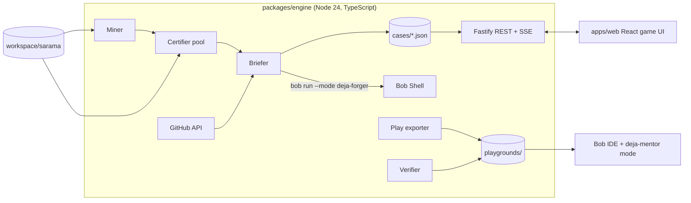

# DejaBug: Project Memory

> This file is the single source of truth for the project. Read it at the start of every session (human, Bob, or Claude). Update the **Status** and **Progress Log** sections at the end of every work session.

---

## 0. Status (update every session)

| Field | Value |
|---|---|
| Current tier | T0 Setup |
| Next action | Install Go, scaffold the monorepo (T0 checklist) |
| Last updated | 2026-09-25 23:00 BST |
| Bobcoins used (ahammadshawki8) | 0 / 40 |
| Bobcoins used (ashfaqstu) | 0 / 40 |
| Blockers | Waiting for the hackathon Bob invite email (arrives after the 9:00 PM kick-off) |

---

## 1. Hackathon facts

- **Event:** IBM Bob 2.0 Hackathon (lablab.ai), online.
- **Hard deadline:** Sun Sep 27 2026, 9:00 PM BST (UTC+6).
- **Our budget:** 40 hours = **35 h development** (Fri 11 PM to Sun 10 AM) + **5 h submission** (Sun 10 AM to 3 PM). Everything after that is buffer.
- **Team:** ahammadshawki8, ashfaqstu.
- **Repository:** https://github.com/ahammadshawki8/DejaBug (public, MIT).
- **Judging:** Application of Technology, Presentation, Business Value, Originality.
- **Hard requirements** (missing any one of these can disqualify us):
  - Bob IDE is a core part of the solution.
  - `bob_sessions/` contains PNG task-summary screenshots from each member.
  - Problem & Solution statement and Bob Usage statement are each 500 words or less.
  - Video is MP4, 3:00 or less, with at least 90 s of the product working and narration.
  - Repo is public with an MIT license.
  - No personal, client, confidential, or social-media data. Every public source is listed in `docs/DATA_SOURCES.md`.
- **Pre-submit check:** `node scripts/check-submission.mjs` and `node scripts/check-style.mjs`.

---

## 2. Rules (must be followed for the whole project)

1. **Commit identity.** Every commit is authored and committed by `ahammadshawki8` or `ashfaqstu`, and nobody else. Never add `Co-Authored-By` trailers, and never list Claude, Bob, srotdev, or any bot as author, committer, collaborator, or contributor. Bob's generated commit messages must be checked for trailers before committing. Before every push, run `git log --format='%an <%ae> | %cn <%ce>%n%b' origin/main..HEAD` and confirm.
2. **No emojis and no em dashes (U+2014)** anywhere in the project: code, comments, docs, UI text, commit messages, slides. Use a plain hyphen or a colon instead. `scripts/check-style.mjs` enforces this.
3. **No personal information in case data.** GitHub usernames, emails, and avatars from issues and PRs are never stored or shown. Store only counts, durations, and redacted text.
4. **Bob builds the product.** Product code is written through Bob tasks (see Section 9). Claude Code reviews and writes review files. It changes product code only under the conditions in Section 9.4.
5. **One checklist item per Bob task.** Each task gets a PNG summary screenshot saved to `bob_sessions/` as soon as it finishes.
6. **Keep this file current.** Tick checklist boxes, update Status, and append to the Progress Log after each work session.
7. **Secrets** (GitHub token, API keys) live only in `.env`, never in git. `.env.example` documents them.
8. **Working software over breadth.** A tier is done only when its "Done when" line is demonstrably true. Never start the next tier with the current one broken.
9. **The frontend must feel like a game**, not an admin panel (see Section 6).

---

## 3. The pitch

**One-liner:** *Pilots train on replays of real incidents. Your new hires train on your team's real bugs.*

**Problem.**
- New engineers take months to become productive, and 67% say their first production-ready contribution took over 4 weeks.
- AI assistants make it worse for the skill that matters most. In Anthropic's 2026 randomized study, developers who learned with AI scored 17% lower on mastery, and **the largest gap was debugging**. Developers who used AI to understand, not to produce, kept their learning.
- Meanwhile every repository holds a perfect, unused curriculum: hundreds of real bugs, each with a known fix and a test that proves it.

**Solution.** DejaBug mines a repository's history for real bug fixes and turns each one into a **certified training case**:
1. Restore the code as it was just before the fix.
2. Add the fix's own test.
3. Prove that the test fails on the buggy code and passes on the real fix.

Bob turns each fix's PR and issue thread into a spoiler-free case file. The new hire then debugs the real bug in Bob IDE, coached by a **read-only Bob Mentor mode that physically cannot write the fix**. They earn XP, ranks, and badges. At the end they get a debrief comparing their fix and time with the original team's.

**Demo repository:** [IBM/sarama](https://github.com/IBM/sarama), a Go client for Apache Kafka (12.5k stars, MIT license).
- Measured on 2026-09-25: 2,889 commits. 822 are fix-like. **174 change both tests and 3 or fewer source files** (the candidate pool).
- Go modules make historical snapshots build reliably.

**Why it wins:**
- **Originality:** SWE-bench-style replay is used to benchmark AI models. We point it at onboarding humans, and we found no existing product that does this.
- **Proof:** every case is verified fail-then-pass, so nothing is guessed.
- **Bob-native:** parallel case forging, subagents, document understanding of PR and issue threads, a custom mode with restricted permissions, and Bob Shell headless runs inside the pipeline.

---

## 4. Features

### 4.1 Engine (CLI + local server)
- **F1 Mine.** Scan `git log` for fix-like commits. Keep those that change `_test.go` files plus 1 to 3 source files. Record the PR number from the commit message. Output a candidate list with metadata.
- **F2 Certify.** For each candidate, in parallel isolated worktrees:
  1. Check out the parent commit.
  2. Overlay the fix commit's test files.
  3. Detect which test functions were added or changed.
  4. Run them 3 times. They must **fail** every time with a test failure, not a build failure.
  5. Overlay the fix's source files and run again. They must **pass**.

  Each candidate gets one status: `certified`, `rejected:build`, `rejected:no-fail`, `rejected:flaky`, `rejected:no-pass`, or `rejected:timeout`. The funnel counts are persisted.
- **F3 Brief (Bob).** For each certified case, fetch the PR and linked issue text through the GitHub REST API. Then call `bob run --format json --mode deja-forger` to produce a case file:
  - codename
  - symptom report written like a user report
  - evidence snippet
  - 3 tiered hints (nudge, direction, near-answer)
  - difficulty 1 to 3
  - precinct (code area)
  - lesson learned
  - tags

  The output is validated with a schema, with one retry.
- **F4 Spoiler guard.** Reject or regenerate any brief that contains identifiers or literals introduced by the fix diff.
- **F5 Original effort.** From the GitHub API: time from issue opened to PR merged, comment count, and review rounds. Counts only, no usernames.
- **F6 Play export.** `dejabug start <case>` exports a clean playground:
  - It contains the snapshot at the parent commit plus the fix's tests, as a fresh git repo with **no future history**, so the answer can't be peeked at.
  - It includes an `AGENTS.md` telling Bob this is a training case, and the `deja-mentor` mode.
- **F7 Verify.** Run the case's tests in the playground and return pass/fail with the parsed failing test names and output.
- **F8 Reveal.** Return the original fix diff, the player's diff, the lesson, and the original-effort stats.
- **F9 Local server.** A REST API plus SSE progress events for forge runs. It serves the web app.

### 4.2 Web app (gamified)
- **W1 Case Board.** A detective cork board of case cards: codename, difficulty stars, precinct, "cold for N days" (age of the bug), and a locked/solved state.
- **W2 Case File.** The symptom report, evidence, precinct, par time, and a "Take the case" button that exports the playground and shows its path.
- **W3 Investigation screen.** A live timer, a hint ladder (each hint costs XP and needs a confirmation), a "Run the tests" button with animated pass/fail, and an "Ask the Mentor" panel explaining how to open the case in Bob IDE with Deja Mentor mode.
- **W4 Debrief.** A case-closed stamp animation, "You: 11m 32s, 1 hint" against "Original team: 3 days, 41 comments", a side-by-side diff (yours vs theirs), the lesson learned, and XP gained.
- **W5 Progression.** XP, ranks (Rookie, Detective, Inspector, Chief Inspector, Commissioner), badges, streak, and a mastery ring per precinct.
- **W6 Forge Console.** A live view of the pipeline: parallel worker lanes, each candidate moving through mine, certify, and brief with a status, plus an animated funnel (822 fix commits, 174 candidates, N certified). This is the "Application of Technology" moment in the video.
- **W7 Showcase mode.** A static build deployed publicly with bundled, pre-forged cases. Verification results in showcase mode are replays of real recorded local runs and are labeled as such.

### 4.3 Bob-native pieces (shipped in the repo)
- **B1** `.bob/custom_modes.yaml`: `deja-forger` (read-only, writes case JSON only) and `deja-mentor` (read-only: can read code and run nothing, Socratic, never writes the fix).
- **B2** `.bob/skills/forge-case/SKILL.md`: instructions and the JSON schema for writing a spoiler-free case file.
- **B3** `.bob/skills/mentor/SKILL.md`: the coaching method (ask, point, never patch).
- **B4** The playground `AGENTS.md` template that tells Bob it is inside a training case.

---

## 5. Architecture



**Stack**
- Engine: Node 24, TypeScript, `tsx`, `commander`, `execa`, `fastify`, `zod`, `p-limit`, `vitest`.
- Web: Vite, React 18, TypeScript, Tailwind CSS, Framer Motion, Zustand, `canvas-confetti`, `diff2html` for diffs, WebAudio sound effects.
- Target toolchain: Go 1.22 or later (for sarama tests).
- Monorepo: npm workspaces.

**Directory layout**
```
DejaBug/
  PROJECT.md  AGENTS.md  README.md  LICENSE
  .bob/  custom_modes.yaml  rules/  skills/
  packages/engine/src/  miner.ts certifier.ts briefer.ts spoiler.ts github.ts
                        play.ts verify.ts server.ts cli.ts store.ts types.ts
  apps/web/src/         pages/ components/ game/ api/ sounds/
  cases/sarama/         <sha>.json (committed, pre-forged)  funnel.json
  workspace/            (gitignored) sarama clone, worktrees
  playgrounds/          (gitignored) exported cases
  docs/  reviews/ submission/ DATA_SOURCES.md DECISIONS.md BOB_USAGE_LOG.md
  bob_sessions/  scripts/
```

**Case JSON (contract between engine and web)**
```ts
type Case = {
  id: string;              // short sha of fix commit
  repo: "IBM/sarama";
  fixSha: string; parentSha: string; prNumber?: number;
  status: "certified";
  tests: string[];         // Go test names
  packages: string[];      // go packages to test
  certification: { failRuns: number; passRuns: number; failOutput: string; passOutput: string; durationMs: number };
  brief: { codename: string; symptoms: string; evidence: string; hints: [string, string, string];
           difficulty: 1 | 2 | 3; precinct: string; lesson: string; tags: string[] };
  original: { daysOpen?: number; comments?: number; reviewRounds?: number; mergedAt: string };
  bugAgeDays: number;      // commit date of fix minus date the buggy code was introduced (approx)
  parSeconds: number;
  fixDiff: string;         // revealed only in debrief
};
```

**REST API**
- `GET /api/cases`
- `GET /api/cases/:id` (no fixDiff)
- `POST /api/cases/:id/start`
- `POST /api/cases/:id/verify`
- `POST /api/cases/:id/hint/:n`
- `GET /api/cases/:id/reveal` (only after a pass, or after giving up)
- `GET /api/funnel`
- `POST /api/forge` + `GET /api/forge/events` (SSE)
- `GET/PUT /api/profile`

**Key decisions** (details in `docs/DECISIONS.md`):
- The playground is exported with `git archive` into a fresh repo, so there is no future history and no answer peeking.
- Cases are pre-forged and committed, so the demo is deterministic and live runs spend no Bobcoins.
- A certified case needs 3 of 3 failing runs, which rejects flaky race tests.

---

## 6. Game design

- **Theme:** a cold-case detective agency. Palette: dark navy, case-file manila, stamp red, neon amber accents. Typewriter font for briefs, bold display font for headings.
- **Core loop:** pick a case, read the file, investigate in Bob IDE, run the tests, close the case, then debrief and earn XP. This unlocks harder cases.
- **XP:** base 100 / 200 / 300 by difficulty. Each hint costs 25% of base. A time bonus of up to +50% applies when under par. A no-hint solve gets a x1.2 multiplier.
- **Ranks:** Rookie 0, Detective 300, Inspector 900, Chief Inspector 2000, Commissioner 4000.
- **Badges:**
  - Cold Case Closed (first solve)
  - Clean Hands (no hints)
  - Beat the Clock (under par)
  - Race Hunter (concurrency tag)
  - Protocol Whisperer (3 protocol cases)
  - Precinct Master (all cases in one precinct)
  - Faster Than The Original (solve time under 1% of the original fix time)
- **Feel:** stamp and paper-slide animations, a typewriter reveal of the symptoms, a red/green terminal for test runs, confetti plus a CASE CLOSED stamp on success, and subtle sound effects with a mute toggle.
- **Accessibility:** keyboard navigable, sufficient contrast, and `prefers-reduced-motion` respected.

---

## 7. Implementation checklist (tier by tier)

Hour estimates add up to 35. "M" marks a milestone that triggers a Claude review (Section 9.3).

### T0 Setup (1 h), target Fri 11:59 PM
- [ ] Install Go (`winget install GoLang.Go`) and verify `go version`.
- [ ] Clone IBM/sarama into `workspace/sarama` (gitignored). Confirm `go test -run TestAsyncProducer -count=1 .` runs.
- [ ] Scaffold npm workspaces: `packages/engine`, `apps/web`. Add shared tsconfig, eslint, prettier, and the vitest setup.
- [ ] Add `.env.example` (`GITHUB_TOKEN`, `DEJABUG_REPO_DIR`, `BOB_MAX_COST`).
- [ ] Add a GitHub Actions CI: lint, typecheck, unit tests, `check-style.mjs`.
- [ ] **Done when:** `npm run build && npm test` passes in an empty scaffold on CI.

### T1 Miner (2 h), target Sat 2:00 AM
- [ ] `miner.ts`: fix-like commit filter, file classification, PR number extraction, and changed test function detection.
- [ ] `dejabug mine --repo workspace/sarama --out cases/sarama/candidates.json`.
- [ ] Unit tests on a fixture git repo.
- [ ] **Done when:** the command outputs 150 or more candidates for sarama in under 30 s.

### T2 Certifier (4 h), target Sat 6:00 AM, **M1**
- [ ] `certifier.ts`: worktree lifecycle, test overlay, go test runner with timeout, output parsing (build failure vs test failure), and the 3-run fail rule and 1-run pass rule.
- [ ] Parallel pool (default concurrency 4) with a progress event emitter.
- [ ] `funnel.json` with a count per status.
- [ ] `dejabug certify --limit 40`.
- [ ] **Done when:** 12 or more certified sarama cases exist with recorded fail/pass output. **Claude review #1.**

### T3 Briefer + spoiler guard + original effort (3 h), target Sat 9:00 AM
- [ ] `github.ts`: PR, linked issue, and comments fetch with ETag cache and username stripping.
- [ ] `briefer.ts`: prompt build and a `bob run --format json --mode deja-forger --max-cost` call, then zod validation with one retry.
- [ ] `spoiler.ts`: extract identifiers and literals from the fix's added lines and reject briefs that contain them.
- [ ] `.bob/custom_modes.yaml` `deja-forger` + `.bob/skills/forge-case/SKILL.md`.
- [ ] **Done when:** 12 or more cases have valid, spoiler-free briefs committed in `cases/sarama/`.

### T4 Game server + play/verify (3 h), target Sat 12:00 PM
- [ ] `play.ts`: `git archive` export, test overlay, fresh `git init`, AGENTS.md template, `.bob/` mentor mode.
- [ ] `verify.ts`: run tests in the playground and parse the results.
- [ ] `server.ts`: all REST endpoints plus SSE. Reveal stays locked until a pass or a give-up.
- [ ] **Done when:** an end-to-end run through curl works: start, apply the real fix by hand, verify passes, reveal works.

### T5 Web core (6 h), target Sat 6:00 PM, **M2**
- [ ] App shell, routing, API client, and the dark detective theme tokens.
- [ ] Case Board, Case File, Investigation (timer, hints, run tests), and Debrief (diff, stats, lesson).
- [ ] Error, loading, and empty states.
- [ ] **Done when:** a full case can be played in the browser against the local engine. **Claude review #2.**

### T6 Gamification (4 h), target Sat 10:00 PM
- [ ] XP engine plus unit tests, ranks, badges, streak, precinct mastery rings, and a persisted profile.
- [ ] Animations (stamp, typewriter, confetti), sound effects with mute, and a rank-up modal.
- [ ] A shareable "Case Closed" card (PNG export).
- [ ] **Done when:** solving a case visibly awards XP and badges, and a rank-up can be triggered.

### T7 Forge Console (3 h), target Sun 1:00 AM
- [ ] SSE-driven parallel worker lanes, an animated funnel, and live Bob brief generation status.
- [ ] **Done when:** clicking "Forge 8 cases" shows the lanes moving in real time against sarama.

### T8 Mentor + Bob IDE integration (2 h), target Sun 3:00 AM
- [ ] `deja-mentor` mode (groups: read only), `.bob/skills/mentor/SKILL.md`, and in-app "Ask the Mentor" instructions.
- [ ] **Done when:** in Bob IDE, the mentor gives Socratic hints on a case and refuses to edit files.

### T9 Hardening + showcase deploy (4 h), target Sun 7:00 AM, **M3**
- [ ] Engine and web tests green. Windows path handling. Timeouts and cleanup of worktrees.
- [ ] Showcase build (static, bundled cases, labeled replayed verification) deployed to Vercel.
- [ ] README with a GIF, architecture, and quickstart.
- [ ] **Done when:** a fresh clone plus quickstart works, and the public URL loads. **Claude review #3, then Bob applies the fixes.**

### T10 Buffer (3 h), until Sun 10:00 AM
- [ ] Fix whatever the reviews and the dry-run demo surfaced.

### S Submission (5 h), Sun 10:00 AM to 3:00 PM
- [ ] Collect all Bob task screenshots into `bob_sessions/` (both members).
- [ ] Problem & Solution statement and Bob Usage statement (500 words or less each).
- [ ] Slides, cover image, and the demo video (3:00 or less, at least 90 s of the product working).
- [ ] Run `check-submission.mjs` and `check-style.mjs`, verify commit authors, push, and submit on lablab.

---

## 8. Demo script (3:00)

| Time | Show |
|---|---|
| 0:00-0:15 | Hook: "Your new hire's first real bug happens in production. What if it happened three months earlier, safely?" Show the Anthropic debugging finding. |
| 0:15-0:40 | Forge Console: 822 fix commits funnel to certified cases, with parallel lanes and Bob writing briefs live. |
| 0:40-1:50 | Play a case: case file typewriter, take the case, open in Bob IDE, ask Deja Mentor (it refuses to patch and asks a question), apply the fix, run the tests, green. |
| 1:50-2:25 | Debrief: CASE CLOSED stamp, "You: 11 min vs original team: 3 days", diff comparison, XP, rank-up, badge. |
| 2:25-2:50 | How Bob powers it: modes, skills, subagents, parallel tasks, headless runs. Numbers from `funnel.json`. |
| 2:50-3:00 | Close: "Every repo already has its curriculum. DejaBug replays it." |

---

## 9. Bob, Bob Shell, and Bobcoin playbook

### 9.1 Is Bob mandatory for the whole project?
No. The rules say Bob IDE must be a **core component** and the repo must contain Bob-assisted code with task-summary screenshots. Other tools are allowed. Our policy:
- **Bob writes the product code.**
- **Claude Code** plans, reviews, and writes review files and non-product docs.
- Claude only touches product code under Section 9.4.

This keeps the Bob Usage statement truthful and strong.

### 9.2 Budget: 80 Bobcoins total (40 per member, no top-ups)

| Tier | Owner | Coins (estimate) |
|---|---|---|
| T0-T2 engine | ahammadshawki8 | 14 |
| T3 briefs (includes runtime `bob run` for about 15 cases) | ahammadshawki8 | 10 |
| T4 server | ahammadshawki8 | 6 |
| T5-T7 web | ashfaqstu | 24 |
| T8 mentor | ashfaqstu | 3 |
| Review fix-ups (3 rounds) | split | 13 |
| Reserve | split | 10 |

Check the balance after every task (Bob IDE Settings, General, or https://bob.ibm.com/admin/subscription). Log each task in `docs/BOB_USAGE_LOG.md`.

### 9.3 The build loop (per checklist item)
1. **Plan mode** (cheap): `@PROJECT.md` Section 7 item Tx.y, plus only the files it touches. Ask for a short plan.
2. **Agent mode**: "Implement the plan. Run the tests. Stop when the Done-when line holds." Enable auto-approve for read and write in the workspace. Keep execute on approval.
3. Verify locally. Ask Bob for the commit message and **strip any trailer**. Commit as yourself.
4. **Screenshot the task summary** into `bob_sessions/dejabug_taskNN_<short>_summary.png`, and add a row to `docs/BOB_USAGE_LOG.md`.
5. At each milestone (M1, M2, M3), Claude Code reads the repo and writes `docs/reviews/REVIEW-0N.md`: numbered, file-referenced fixes and enhancements with acceptance criteria. **No code changes.**
6. A new Bob task: "Apply `@docs/reviews/REVIEW-0N.md` items 1-N. Tick each item when done." Screenshot it.

### 9.4 When Claude Code may write product code
Only when:
- a member's Bobcoins are exhausted, or
- a blocker is burning more than 30 minutes of clock time and Bob has failed twice.

Every such change is logged in `docs/BOB_USAGE_LOG.md` under "Non-Bob changes" so the usage statement stays honest.

### 9.5 Saving Bobcoins
- **One checklist item per task.** Start a new task instead of continuing a long one, because context grows and every turn gets more expensive.
- **Point, don't paste.** Use `@file` mentions for exact files and never @ the whole repo. `.bobignore` excludes `workspace/`, `playgrounds/`, `node_modules/`, and lock files.
- **Use Ask mode for questions and Plan mode for design.** Agent mode is only for edits.
- **Give Bob the acceptance test up front** ("Done when ..."), so it stops early instead of polishing.
- **Batch small fixes** into one review-apply task instead of many tiny tasks.
- **Don't let Bob run the whole sarama test suite.** Always use `-run` with specific tests.
- **Runtime calls are capped:** `bob run --max-cost ${BOB_MAX_COST} --max-turns 6 --disable-mcp`. Briefs are cached by commit SHA and never regenerated unless the prompt changes.
- **Parallel work saves wall-clock time, not coins.** Use two members in parallel (engine and web), not duplicate tasks.

### 9.6 Showing Bob 2.0 features (these are judged, so use each deliberately and screenshot it)
- **Plan mode, then Agent mode**, for every tier.
- **Subagents:** in T2 and T3, ask Bob to "use explore subagents in parallel to inspect these 5 candidate fixes and rank them by teaching value". Screenshot the spawn.
- **Parallel tasks:** run the T5 web and T3/T4 engine tasks concurrently (two members, or two Bob task windows).
- **Document understanding:** the briefer feeds PR and issue text to Bob. Also give Bob the Go testing docs and Kafka protocol docs when needed.
- **Custom modes + skills:** `deja-forger` and `deja-mentor` are product features, not just dev conveniences.
- **Bob Shell headless:** `bob run --format json` is called by the engine at runtime.
- **Code review + commit messages:** use Bob's Review workflow before each milestone commit.

### 9.7 Bob Shell quick reference
- `bob` / `bob chat`: interactive. `/status` shows usage, `/team` switches to the hackathon team, `/mode` switches mode.
- `bob run -p "..." --format json --mode <slug> -w <dir> --max-cost N --max-turns N`: headless.
- `bob --list-tasks`: list tasks. `bob -r <task-id>`: resume.

---

## 10. Data and compliance
- **Source:** IBM/sarama git history, code, and public PR/issue text (MIT license, public GitHub). Listed in `docs/DATA_SOURCES.md`.
- **No personal information:** usernames, emails, and avatars are stripped at fetch time. Only counts and durations are stored.
- **Bundled data:** case JSON contains redacted Bob-written summaries, not verbatim discussion threads.

---

## 11. Session resume protocol
1. Read Section 0 (Status) and the latest Progress Log entry.
2. Run `git log --oneline -10` and `git status`.
3. Continue from the first unchecked box in Section 7.
4. At the end of the session: tick boxes, update Status, and append to the Progress Log.

## 12. Progress log
- **2026-09-25 23:00:** Idea locked (DejaBug). Demo repo chosen: IBM/sarama, with 174 candidate fixes measured. Workspace, Bob config, submission templates, and the check scripts are in place. Bob Shell 2.0.5 is installed. Bob IDE is being installed.
