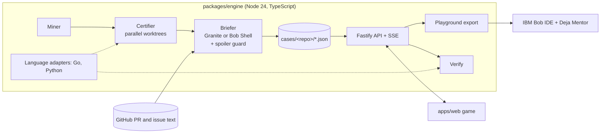

# DejaBug: Project Memory

> The single source of truth for this project, for the human, IBM Bob, Claude Code and Codex. Read Section 0 first at the start of every session. At the end of a session, update Section 0 and append to the Progress Log (Section 12).

**DejaBug** mines a repository's git history for real bug fixes, proves each one (the fix's own test fails 3 out of 3 times on the code before the fix and passes on the fix), and serves the proven bugs as cold cases in a gamified detective web app. A new developer solves each case in IBM Bob, coached by **Deja Mentor**, a read-only Bob mode that cannot write the fix.

*Debug the past. Level up the future.*

---

## 0. Status

| Field | Value |
|---|---|
| Phase | Submission. Development is finished (T0 to T10 done). |
| Next item | S.4: record and upload the demo video, then submit on lablab |
| Next owner | HUMAN |
| Last updated | 2026-09-26 18:00 BST |
| Bobcoins used | 37.37 / 40 (about 2.6 left, reserved for the video: a live Deja Mentor chat and a Bob Shell brief) |
| Blockers | The pitch deck PDF must be exported once more (the ligature fix, see the Progress Log). |

**Links**
- Repository: https://github.com/ahammadshawki8/DejaBug (public, MIT)
- Live showcase: https://ahammadshawki8.github.io/DejaBug/ (GitHub Pages, rebuilt on every push to `main`)
- Pitch deck: `docs/submission/DejaBug Pitch Deck.pdf` (source: the Slides artifact "DejaBug Pitch Deck")

**Deliverables**

| Deliverable | Where | State |
|---|---|---|
| Working product (engine + game) | `packages/engine`, `apps/web` | Done, 106 tests passing |
| Public showcase | GitHub Pages | Live |
| README with GIF, architecture, quickstart | `README.md` | Done |
| Problem & Solution statement (500 words max) | `docs/submission/01-problem-solution.md` | Done (446 words) |
| Bob Usage statement (500 words max) | `docs/submission/02-bob-usage.md` | Done (448 words) |
| Short description, title, tags | `docs/submission/03-short-description.md` | Done |
| Video script and shooting guide | `docs/submission/04-video-script.md` | Done |
| Posters (cover images) | `docs/submission/poster16_9.png`, `poster4_3.png` | Done |
| Pitch deck | `docs/submission/DejaBug Pitch Deck.pdf` | Re-export pending |
| Bob task screenshots | `bob_sessions/` | Done (all 12 tasks) |
| Demo video (MP4, 3:00 max) | uploaded with the submission | To record |

---

## 1. Hackathon facts

- **Event:** IBM Bob 2.0 Hackathon (lablab.ai), online, Sep 25 to 27 2026.
- **Hard deadline:** Sun Sep 27 2026, **8:00 PM BST** (10 AM ET per the IBM account page; lablab shows 9:00 PM, and we plan for the earlier one). The watsonx account closes at the same moment, so anything that calls watsonx live (forging new cases) must be recorded before then.
- **Team:** ahammadshawki8 only. All work is by ahammadshawki8.
- **Judging:** Application of Technology, Presentation, Business Value, Originality.
- **Hard requirements** (missing one can disqualify):
  - IBM Bob is a core part of the solution.
  - `bob_sessions/` holds PNG task-summary screenshots of every Bob task.
  - The Problem & Solution and Bob Usage statements are 500 words or less each.
  - The video is an MP4 of 3:00 or less, with at least 90 s of the product working, and narration.
  - The repository is public with an MIT license.
  - No personal, client, confidential or social-media data; every public source is listed in `docs/DATA_SOURCES.md`.
- **Pre-submit checks:** `node scripts/check-submission.mjs` and `node scripts/check-style.mjs`.

---

## 2. Rules (always in force)

1. **Commit identity.** Every commit is authored and committed by `ahammadshawki8` only. No `Co-Authored-By` or any other attribution line in commits or PRs, and never list Claude, Bob or a bot as author, committer or contributor. Check before every push: `git log --format='%an <%ae> | %cn%n%b' origin/main..HEAD`.
2. **No emojis and no em dashes** anywhere: code, comments, docs, UI text, commit messages, slides. `scripts/check-style.mjs` enforces it.
3. **No personal information.** GitHub usernames, emails, avatars and local paths (they contain the Windows username) never appear in case data, screenshots, docs or videos. Store only counts, durations and redacted text. `scripts/check-cases.mjs` checks the case files.
4. **Secrets** live only in `.env` (gitignored). Every key is documented, empty, in `.env.example`. Never show `.env` on screen. An IBM Cloud key found in a public repo is deactivated and the account suspended.
5. **Honest claims only.** Every number in the README, statements, slides and video comes from real data (`cases/*/funnel.json`, test runs, the usage log). No unverified studies or statistics. Showcase runs are replays of real recorded results and are labelled as replays.
6. **Data sources.** Every repository, dataset and asset is listed with its license in `docs/DATA_SOURCES.md`. Sounds and music are generated in code; no audio files.
7. **Banned watsonx models:** `llama-3-405b-instruct`, `mistral-medium-2505`, `mistral-small-3-1-24b-instruct-2503`. Briefs use `ibm/granite-4-h-small`.
8. **Repository-agnostic.** DejaBug must work on any maintained repository with tests. Language- or repository-specific code (`go test`, `_test.go`, `IBM/sarama`) lives only in `packages/engine/src/adapters/` and config defaults.
9. **The frontend is a game**, not an admin panel (Section 6).
10. **Ownership and handoff.** Every checklist item is tagged [BOB], [CLAUDE] (Claude Code or Codex) or [HUMAN]. Agents do only their own items, plus anything the user asks for directly, and hand off with Section 9.3. One [BOB] item per Bob task, each followed by a summary screenshot in `bob_sessions/`.
11. **Verify before claiming.** Run the gate (Section 5.6) before every commit; check UI changes in a browser.
12. **Tidy up.** The machine is short on memory: stop servers and browsers you start, and remove test playgrounds, sessions and profiles you create.

---

## 3. The pitch

**One-liner:** *Pilots train on replays of real incidents. Your new hires train on your team's real bugs.*

**Problem.**
- A new engineer's hardest early job is debugging code they did not write, and the first real practice usually happens in production, under pressure.
- AI assistants can make this worse: when the AI writes the fix, the new hire skips the practice that builds the skill.
- Every mature repository already holds the missing curriculum: hundreds of fixed bugs, each with a test that proves it. Turning one into a safe exercise by hand takes hours, so it goes unused.

**Solution.** DejaBug turns that history into **proven training cases**:
1. **Mine** commits that fixed a bug and came with a test.
2. **Prove** each one: the test fails 3/3 on the code before the fix and passes on the fix.
3. **Brief:** IBM Granite (batch) or IBM Bob Shell (headless, `deja-forger` mode) writes a spoiler-free case file from the PR and issue thread.
4. **Play:** the player gets a clean playground and fixes the bug in IBM Bob with Deja Mentor.
5. **Debrief:** CASE CLOSED, XP, ranks and badges, and a comparison with the original team.

**Results (all measured)**

| Repository | Language | Commits | Fix-like | Candidates | Certified | Cases |
|---|---|---|---|---|---|---|
| IBM/sarama | Go | 2,889 | 703 | 101 | 27 of 44 attempted | 27 |
| IBM/python-sdk-core | Python | 489 | 98 | 45 | 31 of 45 attempted | 28 |
| google/uuid (connected from the app, never seen before) | Go | | 29 | 10 | 1 of 8 attempted | 1 |

**56 cases** in total, none written by hand. google/uuid went from a pasted URL to a proven, briefed case in about 90 seconds.

**Why it can win**
- **Originality:** SWE-bench-style replay is used to benchmark AI models; DejaBug points it at training people. We found no existing product that does this.
- **Proof:** every case is verified fail-then-pass on the project's own tests.
- **Bob-native:** Bob is inside the product (Bob Shell headless in the pipeline, a read-only custom mode shipped in every playground) and built its core (Plan and Agent modes, parallel subagents, custom modes and skills, code review).
- **Business value:** zero authoring, trustworthy content, private by design (code and test runs stay on each machine; only PR text goes to IBM's AI). Next step: a team server for a shared case library, leaderboards and a manager's view.

---

## 4. Features (as built)

### 4.1 Engine (`packages/engine`, CLI and local server)
- **F0 Onboard.** `dejabug init <owner/repo | URL>` clones into `workspace/<name>` and detects the adapter (`go.mod` = Go; `pyproject.toml`, `setup.py`, `pytest.ini` = Python). `dejabug doctor` checks git, the toolchain, Bob Shell and watsonx. Every command takes `--target <owner/name>`.
- **F1 Mine.** Fix-like commits that change test files plus 1 to 3 source files; PR number from the message; candidates in `cases/<repo>/candidates.json`.
- **F2 Certify.** Parallel git worktrees (default 4 workers): check out the parent, overlay the fix's tests, run the touched tests 3 times (all must fail with a test failure or a hang, not a build error), then the fix tree once (must pass). Statuses: `certified`, `rejected:build`, `rejected:no-fail`, `rejected:flaky`, `rejected:no-pass`, `rejected:timeout`. Results in `certifications.json` and `funnel.json`.
- **F3 Brief.** GitHub PR, linked issue and comments (ETag cache, usernames, emails and avatars stripped). The briefer writes codename, symptoms, evidence, 3 tiered hints, difficulty, precinct, lesson and tags, validated with zod, with one retry. Providers: `watsonx` (Granite, batch) or `bob` (`bob run --format json --mode deja-forger`, prompt on stdin). `Case.briefedBy` records which one.
- **F4 Spoiler guard.** Rejects briefs containing code-shaped identifiers or literals the fix introduced; codename pass keeps codenames unique.
- **F5 Original effort.** Days open, comments and review rounds from GitHub (counts only).
- **F6 Play export.** `dejabug start <id>` (or Take the case) exports the parent commit plus the fix's tests into `playgrounds/<id>` as a fresh single-commit repo (no future history), with `AGENTS.md` and `.bob/` holding the Deja Mentor mode and skill.
- **F7 Verify.** Runs the case's tests on the player's edited playground; reports pass, fail, hang, build or notest with failing test names.
- **F8 Reveal.** The original fix, the player's diff, the lesson and the hints, only after a pass or a give-up.
- **F9 Local server.** Fastify REST API plus SSE forge events; one forge run at a time. Accepts requests only from this machine (Host and Origin checks, JSON bodies only).
- **F10 Showcase export.** `dejabug export-showcase` writes public cases, reveals, recorded runs and forge records for the static build.

### 4.2 Web app (`apps/web`, the game)
- **W1 Case Board.** Cork board of pinned manila folders (codename, precinct tab, difficulty pips, "Cold for N days", XP reward; locked, available, active and solved states), stat tiles, precinct tabs from the data, red string on hover, and an **Archive** switcher so each repository's cases stay separate.
- **W2 Case File.** Two-page dossier: typewriter symptoms, evidence terminal, mission parameters ("Briefed by IBM Bob / Granite"), Take the case, playground path and the Bob steps.
- **W3 Investigation.** Live timer with par, objective, draining XP meter, 3-envelope hint ladder with confirmation, RUN TESTS (shortcut R) with a verdict terminal, give-up with confirmation, and the Ask the Deja Mentor panel.
- **W4 Debrief.** CASE CLOSED stamp, XP count-up with breakdown, rank bar and promotion, badges, the VS panel (you vs the original team), both diffs, the lesson, and a share card (PNG).
- **W5 Progress.** Rank ladder, XP bar, badge collection, precinct mastery rings, streak calendar, closed files, hall of fame.
- **W6 Forge Console.** Repository picker and "open a new precinct", funnel counters, 4 to 8 live worker lanes (Mine, Certify with 3 fail lights and a pass light, Brief), Evidence Locker, discard bin with plain reasons, log terminal.
- **W7 Settings.** Active repository, **Connect a repository** (owner/name or URL; runs the whole pipeline through the Forge), sound effects and volume, **lofi radio** (on/off, volume, 3 stations), reduced motion, profile reset, engine details.
- **W8 Showcase mode.** The same app with bundled data and localStorage progress; runs replay real recorded results, "Replay the original fix" stands in for the edit, and a "How it works when installed" panel explains the two-window setup.
- **W9 Lofi radio.** Three generated stations (Night Shift 72 BPM, Rainy Precinct 66 BPM, Coffee and Code 84 BPM) with a play button in the top bar.

### 4.3 Bob-native pieces (in the repository)
- `.bob/custom_modes.yaml`: `deja-forger` (writes case files), `deja-mentor` (groups: `read` and `skill` only, so it cannot edit files), `submission-writer`.
- `.bob/skills/forge-case/SKILL.md` (brief schema, spoiler rules, hint ladder) and `.bob/skills/mentor/SKILL.md` (ask, point, never patch).
- `.bob/rules/`: project rules and cost guards for Bob.
- The playground `AGENTS.md` template that tells Bob it is inside a training case.

---

## 5. Architecture and development

### 5.1 Overview



**Language adapters** (`packages/engine/src/adapters/`), one `LanguageAdapter` interface: `detect`, `isTestFile`, `isSourceFile`, `isRunnableTestFile`, `testsTouched`, `testTargets`, `runTests` (returns `pass | fail | hang | build | notest` plus failing tests; throws `ToolMissingError` or `TimeoutError`) and `toolCheck`. The miner, certifier and verifier use only this interface. Python repositories use a per-repo virtualenv at `workspace/.venvs/<repo>` when one exists.

### 5.2 Stack
- **Engine:** Node 24, TypeScript 5.9, `commander`, `fastify`, `zod`, `tsx`, `vitest`.
- **Web:** Vite 8, React 18, React Router 7, Tailwind 4 (`@theme` tokens), Framer Motion, Zustand, `pixelarticons`, `@fontsource` (Silkscreen, Special Elite, IBM Plex Sans and Mono), `canvas-confetti`, `diff2html`, WebAudio.
- **Toolchains for the demo repositories:** a current Go release, Python 3 with pytest.
- **CI:** `.github/workflows/ci.yml` (lint, typecheck, tests with Go, build, style and case checks) and `pages.yml` (showcase deploy).

### 5.3 Repository map

| Path | What |
|---|---|
| `packages/engine/src/` | miner, certifier, briefer, spoiler, codenames, github, llm/watsonx, assemble, play, verify, forge, server, store, showcase, cli, types |
| `packages/engine/src/adapters/` | Go and Python adapters |
| `apps/web/src/` | `pages/`, `components/game/` (design system), `art/` (pixel sprites), `lib/` (rules, solve, badges, sound, lofi, forgeView), `state/`, `api/` (live engine or showcase) |
| `cases/<repo>/` | Case files plus candidates, certifications and funnel (sarama, python-sdk-core, uuid) |
| `.bob/` | Custom modes, skills, rules |
| `bob_sessions/` | Bob task summary screenshots |
| `docs/` | `submission/`, `reviews/` (REVIEW-01 to 04, BOB-REVIEW), `media/` (GIF and screenshots), `BOB_USAGE_LOG.md`, `DATA_SOURCES.md`, `DECISIONS.md`, `ENGINE_PLAN.md` |
| `scripts/` | `check-style.mjs`, `check-cases.mjs`, `check-submission.mjs` |
| `workspace/`, `playgrounds/`, `.dejabug/` | Cloned repositories, exported playgrounds, local engine state (all gitignored) |

### 5.4 Case JSON (the contract between engine and web)

```ts
interface Case {
  id: string;             // short sha of the fix commit
  repo: string;           // "IBM/sarama"
  language: string;       // adapter id
  fixSha: string; parentSha: string; prNumber?: number;
  status: "certified";
  tests: string[]; packages: string[]; testFiles: string[];
  certification: { failRuns: number; passRuns: number; failOutput: string; passOutput: string; durationMs: number };
  brief: { codename: string; symptoms: string; evidence: string; hints: [string, string, string];
           difficulty: 1 | 2 | 3; precinct: string; lesson: string; tags: string[] };
  original: { daysOpen?: number; comments?: number; reviewRounds?: number; mergedAt: string };
  bugAgeDays: number; parSeconds: number;
  briefedBy?: string;     // "bob-shell" or "watsonx:<model id>"
  fixDiff: string;        // revealed only in the debrief
}
```
The public view (before a solve) hides `fixDiff`, the lesson and the hints.

### 5.5 REST API
`GET /api/health`, `GET /api/repos`, `GET /api/cases`, `GET /api/cases/:id`, `GET /api/cases/:id/session`, `POST /api/cases/:id/start`, `POST /api/cases/:id/hint/:n`, `POST /api/cases/:id/verify`, `POST /api/cases/:id/giveup`, `GET /api/cases/:id/reveal` (403 until solved or given up), `GET /api/funnel`, `GET|PUT /api/profile`, `POST /api/forge` (any `owner/name` or a known repository), `GET /api/forge/status`, `GET /api/forge/events` (SSE). All take `?repo=<name>` where relevant.

### 5.6 Commands and the gate

```bash
npm install
npm run dev                       # engine on :4317 (local only) and web on http://localhost:5173
npm run dejabug -- <command>      # doctor, init, mine, certify, brief, start, serve, export-showcase, codenames, models
npm run dejabug -- --target owner/name mine
npm run showcase                  # static showcase build
```

**The gate** (before every commit):
```bash
npm run lint && npm run typecheck && npm test && npm run build
npx prettier --check .
node scripts/check-style.mjs && node scripts/check-cases.mjs && node scripts/check-submission.mjs
```
On Windows, Go is at `C:\Program Files\Go\bin`; a shell opened before Go was installed may lack it on PATH, which skips the Go tests. All 106 tests should run with none skipped.

### 5.7 Key decisions (details in `docs/DECISIONS.md`)
- Playgrounds are fresh single-commit repositories: no future history, no answer peeking.
- Cases are pre-forged and committed, so the demo is deterministic and costs no Bobcoins at run time.
- 3 of 3 failing runs are required, which rejects flaky tests; a hang counts as a reproduced deadlock.
- The engine is a local tool: it runs strangers' test code, so it never runs as a public server. The public face is the static showcase.

### 5.8 Known limitations
- Only Go and Python adapters today.
- A new repository needs its toolchain installed and an AI key (watsonx or Bob) for the briefs.
- GitHub Pages answers deep links with HTTP 404 (the app still loads from the fallback page); share the root URL.
- The mentor demo case (The Overflowing Slice) is difficulty 3 and locked for a new Rookie.

---

## 6. Game design

- **Theme:** a cold-case detective agency. Navy environment, manila and paper case files, stamp red for failure and key actions, amber for interaction and XP, green only for verified.
- **Core loop:** pick a case, read the file, investigate in IBM Bob, run the tests, close the case, debrief, earn XP, unlock harder cases.
- **XP:** base 100 / 200 / 300 by difficulty; each hint costs 25% of base; up to +50% time bonus under par; x1.2 for a no-hint solve.
- **Ranks:** Rookie 0, Detective 300, Inspector 900, Chief Inspector 2000, Commissioner 4000. Difficulty 3 cases unlock at Detective.
- **Badges:** Cold Case Closed (first solve), Clean Hands (no hints), Beat the Clock (under par), Race Hunter (concurrency case), Protocol Whisperer (3 protocol cases), Precinct Master (all cases in a precinct), Faster Than The Original (under 1% of the original fix time).
- **Feel:** stamp and paper-slide animations, typewriter symptoms, a red and green test terminal, confetti only on a first solve or rank-up, synthesized sounds and an optional lofi radio.
- **Accessibility:** keyboard shortcuts (R runs tests, H opens the next hint, Esc closes modals), amber focus rings, AA contrast, `aria-live` for results, reduced motion respected.

---

## 6A. Frontend design system (as built)

**The 3-second test:** any screen seen for 3 seconds should read "detective debugging game", never "admin dashboard".

- **Principles:** tactile detective objects (manila folders, dossier tabs, evidence sheets, cork board, stamps, terminal readouts), thick dark outlines with hard offset shadows, flat colour blocks, pixel art, dense but clean blocks. No SaaS look, gradients, glassmorphism or large radii. Every decoration has a gameplay purpose; progression is always visible in the shell.
- **Tokens** (`apps/web/src/styles/index.css`, `@theme`; never hardcode hex in components):

| Token | Value | Use |
|---|---|---|
| `ink` | `#0B1426` | App background |
| `navy` | `#14223F` | Rail, dark panels, terminal frame |
| `navy-2` | `#1E3159` | Raised dark surfaces |
| `line` | `#05080F` | Outlines and hard shadows |
| `manila` | `#E8D49B` | Folders, cards |
| `paper` | `#F7F1E1` | Documents |
| `cork` | `#B98A5A` | Case board |
| `stamp` | `#D7263D` | Fail, danger, CASE CLOSED |
| `amber` | `#FFB627` | Interaction, XP, active nav, focus |
| `pass` | `#2FA84F` | Verified |
| `muted` | `#8A93A6` | Secondary text on dark |
| `text-dark` | `#1A1A1A` | Text on paper and manila |

  Outline 3 px; shadow `4px 4px 0 line`; pressed = translate 2 px; radius 2 px.
- **Type:** Silkscreen (pixel) for short labels, ribbons, codenames and stamps only; Special Elite for case reports; IBM Plex Sans for UI text; IBM Plex Mono for numbers, timer and code. Never paragraphs in the pixel font. (The pitch deck uses Pixelify Sans instead of Silkscreen for readability at slide size.)
- **Art:** UI icons from `pixelarticons`; rank insignias (5), badges (7), pin, clip and magnifier are custom pixel sprites in `apps/web/src/art/sprites.tsx`, the source for any artwork.
- **Shell:** sticky 80 px navy rail (Case Board, Investigation, Forge, Progress, Settings), sticky top bar (ribbon title, rank insignia and XP bar, streak, lofi and sound buttons, engine light) and a dispatch ticker of lessons.
- **Components** (`apps/web/src/components/game/`): ArcadeButton, IconButton, PaperPanel, DarkPanel, StatTile, RibbonTitle, Stamp, TypewriterText, Terminal, CaseFolder, DossierTabs, HintLadder, Timer, VersusPanel, XpBar, CountUp, MasteryRing, BadgeCard, StreakCalendar, WorkerLane, FunnelCounter, Modal, Toast, Tooltip, DiffView, MentorPanel, HowItWorks. Screens are composed from these, with no page-specific one-off styling.
- **Motion:** UI feedback 120 to 200 ms, paper slides 300 to 400 ms, stamp about 220 ms with overshoot, counters 500 to 700 ms; under reduced motion everything becomes a fade.
- **Sound:** synthesized (click, stamp, fail, pass, rank-up, hint) plus the lofi radio; audio starts only after the first user gesture.
- **States:** themed loading (paper sliding in), empty ("No open cases. Fire up the Forge."), engine offline ("Radio silence from HQ"), and errors as stamped memos with a retry; a stale chunk after a deploy reloads once.

---

## 7. Checklist

Every item has one owner: **[BOB]** (IBM Bob, one item per task), **[CLAUDE]** (Claude Code or Codex), **[HUMAN]**. "(re-tagged)" marks items moved from Bob to Claude to save Bobcoins (Section 9.2).

### T0 Setup
- [x] T0.1 [HUMAN] Install Go (go1.27.0).
- [x] T0.2 [HUMAN] Clone IBM/sarama into `workspace/sarama`.
- [x] T0.3 [CLAUDE] npm workspaces, tsconfig, eslint, prettier, vitest, dev scripts.
- [x] T0.4 [CLAUDE] `.env.example`.
- [x] T0.5 [CLAUDE] CI: lint, typecheck, tests, style check.
- [x] **Done when:** build and tests pass locally and on CI.

### T1 Engine plan + Miner
- [x] T1.1 [BOB] Plan mode: engine design in `docs/ENGINE_PLAN.md`.
- [x] T1.2 [CLAUDE] `miner.ts` and `dejabug mine`.
- [x] T1.3 [CLAUDE] Miner tests on a fixture repository.
- [x] **Done when:** candidates mined in under 30 s. Result: 101 sarama candidates in 10 s (functional tests that need a live Kafka broker are excluded).

### T2 Certifier (M1)
- [x] T2.1 [BOB] Certifier core: worktrees, test overlay, runner, fail/pass rules, statuses.
- [x] T2.2 [BOB] Parallel certification pool with progress events.
- [x] T2.3 [CLAUDE] Funnel writer, `dejabug certify`, tests.
- [x] T2.4 [HUMAN] First certification batch.
- [x] T2.5 [CLAUDE] REVIEW-01.
- [x] T2.5a [CLAUDE] Repository-agnostic engine: adapters, `dejabug init`, `--target`.
- [x] T2.6 [BOB] REVIEW-01 [BOB] items; the certifier runs on adapters.
- [x] T2.7 [CLAUDE] REVIEW-01 [CLAUDE] items.
- [x] **Done when:** 12 or more certified sarama cases. Result: 27 of 44 attempted.

### T3 Briefs
- [x] T3.1 [CLAUDE] `github.ts` with redaction and original effort.
- [x] T3.2 [CLAUDE] `llm/watsonx.ts` (Granite).
- [x] T3.3 [BOB] The forger: `deja-forger` mode, `forge-case` skill, `briefer.ts`.
- [x] T3.4 [BOB] Four parallel subagents rank the cases (`cases/sarama/ranking.json`).
- [x] T3.5 [CLAUDE] `spoiler.ts`.
- [x] T3.4b [CLAUDE] `dejabug brief` and case assembly.
- [x] T3.3b [BOB] REVIEW-T3.3 fixes.
- [x] T3.6 [HUMAN] Granite briefs for all 27 cases, plus one Bob Shell headless brief (fc42022, 18.7 s).
- [x] **Done when:** 12 or more spoiler-free briefs. Result: 27, unique codenames, checked in CI.

### T4 Game server, play, verify
- [x] T4.1 [CLAUDE] `play.ts`.
- [x] T4.2 [CLAUDE] `verify.ts`.
- [x] T4.3 [CLAUDE] `server.ts` with SSE.
- [x] T4.4 [CLAUDE] Python adapter.
- [x] T4.5 [HUMAN, done by Claude] Second repository: IBM/python-sdk-core, 31 certified, 28 briefed.
- [x] **Done when:** start, fix, verify and reveal work end to end. Verified through the API and the server integration test.

### T5 Web core (M2)
- [x] T5.1 [CLAUDE] Web scaffold, API client, stores.
- [x] T5.2 [CLAUDE] (re-tagged) Design system and `/styleguide`.
- [x] T5.3 [CLAUDE] Game shell.
- [x] T5.4 [BOB] Case Board.
- [x] T5.5 [CLAUDE] Case File.
- [x] T5.6 [CLAUDE] (re-tagged) Investigation and Debrief.
- [x] T5.7 [CLAUDE] States, shortcuts, reduced motion.
- [x] T5.8 [CLAUDE] REVIEW-02.
- [x] T5.9 [CLAUDE] (re-tagged) REVIEW-02 items.
- [x] T5.10 [CLAUDE] REVIEW-02 [CLAUDE] items.
- [x] **Done when:** a full case is played in the browser against the local engine. Verified in the final checkup (google/uuid case: real failure, real pass, debrief).

### T6 Gamification
- [x] T6.1 [CLAUDE] XP, ranks, badges, streak, mastery, profile.
- [x] T6.2 [CLAUDE] Progress screen, modals, sounds.
- [x] T6.3 [CLAUDE] Share card.
- [x] **Done when:** a solve awards XP and badges and can trigger a rank-up. Verified (promotion to Detective with 5 badges).

### T7 Forge Console
- [x] T7.0 [CLAUDE] "Open a new precinct": the forge accepts any `owner/name`; repository picker in the Forge Console.
- [x] T7.1 [CLAUDE] (re-tagged) Forge Console with live SSE lanes, funnel, Evidence Locker, discard bin.
- [x] **Done when:** a forge run shows the lanes moving live. Verified with google/uuid (cloned, mined, certified in parallel and briefed live).

### T8 Mentor
- [x] T8.1 [BOB] `deja-mentor` mode (read only) and the mentor skill.
- [x] T8.2 [CLAUDE] Ask the Deja Mentor panel and `dejabug start`.
- [x] T8.3 [HUMAN] Recorded live mentor session: it coached and declined to write the patch (0.252 coins).
- [x] **Done when:** the mentor gives Socratic hints and refuses to edit files.

### T9 Hardening + showcase (M3)
- [x] T9.1 [BOB] Bob code review: `docs/reviews/BOB-REVIEW.md` (0.891 coins).
- [x] T9.2 [CLAUDE] REVIEW-03 (Bob's findings verified and merged with Claude's).
- [x] T9.3 [CLAUDE] (re-tagged) REVIEW-03 items, including the request guard.
- [x] T9.4 [CLAUDE] Tests green, Windows paths, timeouts, worktree cleanup.
- [x] T9.5 [CLAUDE] Static showcase on GitHub Pages; README with GIF, architecture and quickstart.
- [x] **Done when:** a fresh clone plus the quickstart works and the public URL loads.

### T10 Buffer
- [x] T10.1 [HUMAN, done by Claude] Demo dry run; notes in `docs/reviews/REVIEW-04.md`.

### S Submission
- [x] S.1 [HUMAN] (audited by Claude) Every Bob task screenshot in `bob_sessions/`; usage log complete.
- [x] S.2 [CLAUDE] Both statements (500 words max), short description, title, tags, video script.
- [x] S.3 [HUMAN] Posters, pitch deck and the video script. (The video itself is recorded as part of S.4.)
- [ ] S.4 [HUMAN] Re-export the pitch deck PDF, record the video (`docs/submission/04-video-script.md`), run `check-submission.mjs` and `check-style.mjs`, confirm commit authors, push, and submit on lablab before the deadline. The automated checks already pass (2026-09-26 17:30).

---

## 8. Demo video

The full script, shot list, narration (about 370 words) and editing guide are in `docs/submission/04-video-script.md`. In short (2:57, about 2:25 of product):

| Time | Scene |
|---|---|
| 0:00-0:14 | A question for developers: "Think back to the first bug you fixed in code you didn't write. Where did you learn how?" |
| 0:14-0:22 | The idea |
| 0:22-0:40 | Clone, install, run locally |
| 0:40-0:52 | Connect google/uuid from Settings |
| 0:52-1:20 | The Forge proves cases live (fail 3/3, then pass) |
| 1:20-1:35 | Take The Phantom Batch |
| 1:35-2:05 | Solve it in IBM Bob with Deja Mentor, which refuses to write the fix; the one-line fix at `async_producer.go` line 1164 |
| 2:05-2:15 | Run the tests: VERIFIED |
| 2:15-2:30 | Debrief: minutes vs the original team's 46 days |
| 2:30-2:44 | IBM Bob under the hood: Deja Forger, Deja Mentor, how it was built |
| 2:44-2:57 | Open invitation to clone it |

Record the Forge and Deja Forger scenes before the watsonx account closes.

---

## 9. Division of labour, budget and handoff

### 9.1 Policy
IBM Bob must be a core component, and the repository must contain Bob-assisted work with task screenshots. With 40 Bobcoins, Bob built the parts that define the product and that judges look at: the engine plan, the certifier and its parallel pool, the forger mode and skill, the subagent ranking, the Case Board, the mentor mode, the live mentor session and the code review. Claude Code built the plumbing, server, tests, most screens, deployment and docs. Every Claude item is listed in `docs/BOB_USAGE_LOG.md`, and the Bob Usage statement describes the split honestly.

### 9.2 Bobcoins (final)

| Item | Coins |
|---|---|
| T1.1 Plan mode engine design | 0.555 |
| T2.1 Certifier core | 3.33 |
| T2.2 Parallel pool | 2.34 |
| T2.6 REVIEW-01 fixes, adapters | 3.21 |
| T3.3 Forger (mode, skill, briefer) | 4.00 |
| T3.4 Subagent ranking | 1.19 |
| T3.3b Forger fixes | 14.82 (read a large bundle; led to the cost guards) |
| T5.4 Case Board | 4.43 |
| T3.6 Bob Shell headless brief and small tasks | about 1.62 (from the Bob usage dashboard) |
| T8.1 Deja Mentor mode and skill | 0.732 |
| T8.3 Live Deja Mentor session | 0.252 |
| T9.1 Bob code review | 0.891 |
| **Total** | **37.37 of 40** (about 2.6 left) |

Re-tagged to Claude to save coins: T5.2 design system, T5.6 Investigation and Debrief, T5.9, T7.1 Forge Console, T9.3 REVIEW-03 fixes.

**Cost guards:** Bob never reads `node_modules`, bundles, minified files or tool sources; if a Bob task passes about 60k context or its cap, it stops and hands off; the human puts known facts into the prompt; runtime calls are capped with `bob run --max-cost ${BOB_MAX_COST} --max-turns 6 --disable-mcp`.

### 9.3 Handoff protocol
**On start:** read Section 0 and Section 7, find the first unchecked item. If you are not its owner, print the handoff block and stop.

**While working:** do only the current item (or the user's direct request). Bob: one [BOB] item per task. Claude: may do several consecutive [CLAUDE] items and stops at the first [BOB] or [HUMAN] item.

**On finish:** tick the items, update Section 0, append to Section 12, list Claude work in `docs/BOB_USAGE_LOG.md`, and print:
```
HANDOFF
Done: <item IDs>
Next: <item ID> [<OWNER>] <one-line summary>
Human, do this:
  1. Review and commit (as ahammadshawki8, no attribution lines)
  2. <If Bob just finished> Screenshot the task summary to bob_sessions/dejabug_taskNN_<short>_summary.png and log it in docs/BOB_USAGE_LOG.md
  3. Open <Bob IDE | Claude Code | Codex> and paste: "Read PROJECT.md. Do item <ID> only, following Section 9.3."
```

### 9.4 Bob 2.0 features used (judged)

| Feature | Where |
|---|---|
| Plan mode | T1.1 and the plan step of Bob items |
| Agent mode | T2.1, T2.2, T2.6, T3.3, T5.4 |
| Parallel work | T2.2 certification pool; Bob and Claude working at the same time |
| Subagents | T3.4 four parallel explore subagents |
| Document understanding | T3.3 reads PR and issue threads |
| Custom modes and skills | `deja-forger`, `deja-mentor`, `forge-case`, `mentor` (product features) |
| Bob Shell headless | T3.6 `bob run --format json` inside the pipeline |
| Code review | T9.1 |

### 9.5 Bob Shell quick reference
- `bob` / `bob chat`: interactive (`/status` usage, `/mode` switch mode).
- `bob run --format json --mode <slug> --max-cost N --max-turns N`: headless, prompt on stdin.
- Needs `BOB_API_KEY` (Inference scope) in `.env` for the pipeline.

### 9.6 watsonx.ai
- IBM Granite `ibm/granite-4-h-small` writes the batch briefs and codenames through `llm/watsonx.ts`.
- Credentials only in `.env`. The account closes Sep 27 at 10 AM ET (8 PM BST); the showcase never calls watsonx at run time.

---

## 10. Data and compliance
- **Sources:** IBM/sarama (MIT), IBM/python-sdk-core (Apache-2.0) and google/uuid (BSD-3-Clause): code, git history and public PR and issue text. Listed in `docs/DATA_SOURCES.md`.
- **No personal information:** usernames, emails and avatars are stripped at fetch time; local paths are scrubbed from outputs; `check-cases.mjs` enforces it in CI.
- **Bundled data:** case files hold AI-written summaries and counts, not verbatim discussion threads.
- **Audio:** all sounds and music are generated in code.

---

## 11. Session resume protocol
1. Read Section 0 and the latest Progress Log entry.
2. Run `git log --oneline -10` and `git status`.
3. Continue from the first unchecked item in Section 7 if you own it; otherwise print the handoff block.
4. At the end: tick boxes, update Section 0, append to the Progress Log, run the gate, commit as ahammadshawki8.

---

## 12. Progress log
- **2026-09-25 23:00:** Idea locked (DejaBug). Demo repo chosen: IBM/sarama, with 174 candidate fixes measured. Workspace, Bob config, submission templates, and the check scripts are in place. Bob Shell 2.0.5 is installed. Bob IDE is being installed.
- **2026-09-26 00:10:** T0 done (Claude): npm workspaces (engine + web), TypeScript 5.9, vitest 5, eslint 10, prettier, Vite 8 + React 18, CI workflow, and .env.example. The engine has types.ts (the case contract), config.ts, and `dejabug doctor` / `serve` (health endpoint). Gate green locally. Next: T1.1 [BOB].
- **2026-09-26 00:15:** T1 done. T1.1 (Bob, Plan mode, 0.555 coins) produced docs/ENGINE_PLAN.md. T1.2-T1.3 (Claude): miner.ts, git.ts, the `dejabug mine` CLI, and fixture-repo tests (17 tests green). sarama: 2,889 commits, 703 fix-like, 101 runnable candidates in cases/sarama/candidates.json. Next: T2.1 [BOB] certifier core.
- **2026-09-26 00:45:** T2.1 done by Bob (3.33 coins, Plan then Agent). Claude review (docs/reviews/REVIEW-T2.1.md) found 3 correctness defects, all verified with go test: build failures read as test failures, unanchored -run, and no-tests-to-run read as a pass. It also found robustness issues and lint errors. They are bundled into Bob's T2.2 task. T2.1 is committed locally and not pushed until lint passes.
- **2026-09-26 01:20:** T2.2 done by Bob (2.34 coins): p-limit pool plus all 7 REVIEW-T2.1 fixes. T2.3 done by Claude: store.ts (atomic JSON, merge, funnel), `dejabug certify` (--limit/--concurrency/--only/--redo), and certifier tests on a real Go fixture covering all statuses (21 tests). Go added to CI. Smoke run on sarama: 2 of 4 certified in 25 s with 4 workers. Notes for REVIEW-01: (a) worker slot is i % concurrency, not a true slot, (b) fail output contains the local temp path, which includes the Windows username, (c) rejected:build stores no output.
- **2026-09-26 01:50:** T2.4 batch: the first run was invalid (no Go on PATH in that terminal, so 40 were misread as build failures). The CLI now has a Go preflight. The rerun gives **23 certified of 44 attempted** (9 build, 5 no-fail, 2 no-pass, 5 timeout; the timeouts are hang bugs). Temp paths were scrubbed from the data. T2.5 REVIEW-01 is written (5 [BOB] items, 4 [CLAUDE] items). Next: T2.6 [BOB].
- **2026-09-26 02:00:** Product decision (user): DejaBug must work on any well-maintained repository, not just sarama. Added Rule 10, F0 Onboard, the language adapter architecture, and new items T2.5a (adapter refactor, Claude, before Bob's T2.6), T4.4 (Python adapter), T4.5 (second-repo proof), and T7.0 (repo picker). REVIEW-01 items 1 and 4 move into the Go adapter.
- **2026-09-26 02:45:** T2.5a done (Claude). The engine is repository-agnostic: `adapters/` (the LanguageAdapter interface, errors, registry, and a Go adapter with anchored -run, hang/notest/build classification, ToolMissingError, and multi-module routing by nearest go.mod). The miner runs on the adapter. `Candidate.language`, `dejabug init <owner/repo>`, a global `--target`, and an adapter-driven doctor and preflight were added. 35 tests. Second repo proven at the mining level: IBM/fp-go gives 137 candidates. Its recent fix: commits are mostly API additions (genuine build rejections). REVIEW-01 item 10 added (the pass phase restores the full fix tree). Next: T2.6 [BOB].
- **2026-09-26 03:40:** M1 reached. T2.6 (Bob, 3.21 coins): the certifier runs on adapters, and 4 of 5 hang bugs are now certified. **sarama: 27 certified of 44 attempted.** T2.7 (Claude): store sanitizes on merge (stripLocalPaths), DEJABUG_TEST_TIMEOUT_SEC added, tests for deadlock certification, ToolMissingError abort, output sanitizing, and build-output recording (42 engine tests). Queued for REVIEW-02 [BOB]: for hang results, keep the head of the output (the "panic: test timed out ... running tests: TestX" headline) instead of the tail of the goroutine dump.
- **2026-09-26 04:10:** T3.1 (github.ts: PR resolution by commit, linked issues, ETag disk cache, gh auth token fallback, redaction of mentions/emails/attachments, original effort as counts only), T3.2 (llm/watsonx.ts: IAM token cache, chat API, banned-model guard, `dejabug models`, extractJson), and T3.5 (spoiler.ts, language-agnostic) done by Claude. 58 tests. Added T3.4b (brief CLI and case assembly). Next: T3.3 [BOB] forger.
- **2026-09-26 04:30:** watsonx is live. The account lists granite-4-h-small, granite-guardian-3-8b, llama-3-3-70b, llama-4-maverick, mistral-large-2512, and gpt-oss-120b (banned models are filtered). WATSONX_MODEL_ID is ibm/granite-4-h-small, and a test chat returned valid JSON in 3.7 s. The secrets had been typed into .env.example; they were moved to .env before any commit, and check-style now fails if .env.example holds a secret value.
- **2026-09-26 04:55:** T3.3 done by Bob (4.00 coins): the deja-forger mode, the forge-case skill, and briefer.ts (watsonx and bob providers, zod, spoiler retry) with tests. Claude hygiene fix to Bob's test (vitest 5 generics, type-import lint, prettier) to keep CI green without spending coins. The Claude spoiler guard was refined: comments and plain English words are no longer spoilers, only code-shaped identifiers and literals. First real Granite brief for fc42022 succeeded in 3.9 s (PR #3579, 1.7 days open, 3 review rounds). Review notes are queued in docs/reviews/REVIEW-02-queue.md.
- **2026-09-26 05:10:** T3.4 done by Bob (1.19 coins): 4 explore subagents in parallel ranked all 27 certified cases into cases/sarama/ranking.json (teaching value, difficulty, precinct from a fixed list, reason). Screenshots of the parallel subagents are saved. Reasons are internal only, because some hint at the fix.
- **2026-09-26 05:40:** T3.4b done (Claude): assemble.ts (bugAgeDays via git blame of the lines the fix touched, par time 10/20/30 min, ranking overrides for precinct/difficulty, sanitized outputs) and `dejabug brief` (parallel, --only/--limit/--redo/--provider). A real run on 3 cases with Granite: 2 good, 1 with hints copied from the SKILL.md examples (file deleted). Wrote REVIEW-T3.3 and added T3.3b [BOB] before T3.6. 66 tests.
- **2026-09-26 06:30:** T3.3b done by Bob (14.82 coins, far over budget: 142k context from reading the bob.js bundle). Result is good: skill examples removed, codename rules added, JSON retry, client reuse, the bob provider parses the `last_message` envelope, and it uses shell on Windows with the prompt on stdin (unverified until T3.6). Coin re-plan: T5.2, T5.6, T7.1, and T9.3 re-tagged to Claude, and cost guards added (Section 9.2 and .bob/rules).
- **2026-09-26 07:00:** Granite briefs generated for all 27 certified sarama cases in 47 s (the spoiler guard fixed 3 leaks by retry). The model reused the skill's example codename 10 times, so Claude added codenames.ts plus `dejabug codenames` (a unique-name pass with Granite, also run after every brief batch). All 27 are unique. scripts/check-cases.mjs (paths, emails, mentions, duplicate codenames) was added to CI. Highlight for the demo: 66e60c7 "Infinite Coordinator Loop" was cold for 1,513 days.
- **2026-09-26 07:30:** T3.6 complete. With BOB_API_KEY (Inference scope) in .env, `brief --provider bob` ran Bob Shell headless with the deja-forger mode and forge-case skill, and wrote fc42022 "The Overflowing Slice" in 18.7 s (prompt on stdin verified). Its quality beats Granite (a richer hint ladder). Added `Case.briefedBy` (bob-shell or watsonx:<model>) and backfilled the 27 cases, so the UI can show which IBM engine wrote each brief.
- **2026-09-26 08:30:** T4.1-T4.3 done (Claude). play.ts exports the parent commit via a worktree with autocrlf off, overlays the fix tests, and makes a fresh single-commit repo with AGENTS.md and the deja-mentor mode. verify.ts runs the adapter with a 20 s per-test timeout. forge.ts holds the pipeline shared by the CLI and the server. server.ts (Fastify) serves health, repos, cases (public view hides fixDiff, lesson, and hints), session, start, ordered hints, verify, giveup, reveal (403 until solved or given up), funnel, profile, and forge plus SSE events (one run at a time). Sessions persist in .dejabug/state.json. Case.testFiles was added and backfilled.
- **2026-09-26 03:40 (real clock):** Note: progress-log times after 02:45 were estimates that ran ahead of the real clock; the real time is now Sat 03:40. T4.4 done: Python adapter (pytest: test file and name detection incl. classes, exit-code classification, hang = killed at timeout, the checked-out code comes first on PYTHONPATH, per-repo virtualenv at workspace/.venvs/<repo> activated automatically). T4.5 proven on **IBM/python-sdk-core**: 489 commits, 98 fix-like, 45 candidates in 3.2 s, **31 certified in 44 s**, and 28 briefed with Granite. Total: **55 cases across 2 languages and 2 IBM repos**. The privacy sanitizer now redacts home directories in any separator form plus truncated worktree names. check-cases scans every JSON file for local paths, and prose only for emails and @mentions (Python decorators in diffs are fine). 87 tests. Follow-up idea: `dejabug init` could create the Python virtualenv automatically.
- **2026-09-26 03:35:** T5.1-T5.3 done (Claude). Web: Vite 8 + React 18 + Tailwind 4 (@theme tokens from 6A.3) + Framer Motion + Zustand + React Router 7, self-hosted fonts, pixelarticons. Typed API client (types shared from the engine via the @engine alias), game, profile, and settings stores. Design system: pixel art from character grids (5 rank insignias, 7 badges, pin, clip, magnifier pips), and the full 6A.10 component inventory (ArcadeButton, Panels, StatTile, RibbonTitle, Stamp, TypewriterText, Terminal, XpBar, CountUp, MasteryRing, BadgeCard, StreakCalendar, CaseFolder with 4 states, HintLadder, Timer, VersusPanel, Modal, Toast, Tooltip, DossierTabs, FunnelCounter, WorkerLane), shown at /styleguide. The game shell has the rail, a top bar with rank/XP/streak/mute/engine light, and a dispatch ticker. XP rules are in lib/rules.ts with tests. Visual review via Playwright screenshots, with 5 fixes applied. Engine dev script switched to node --watch (tsx watch hung under concurrently on Windows).
- **2026-09-26 04:10:** T5.4 done by Bob (4.43 coins): Case Board with stat tiles, precinct tabs, cork grid, the four folder states, red string on hover, and loading/error/empty states. Claude fixes: precinct tabs are derived from the data instead of hardcoded sarama areas (Rule 10; consumer-group had no tab), and a stray footer was removed. T5.5 done (Claude): Case File dossier (two pages sliding in, typewriter symptoms, wrapped evidence terminal, mission parameters incl. "Briefed by IBM Bob/Granite", Take the case, playground path with copy, Bob IDE + Deja Mentor steps). **Only 4.5 Bobcoins left** (35.5 used, per the user): Bob does only T8.1 mentor mode, T8.3 live mentor demo, and T9.1 code review. T5.9 is re-tagged to Claude. Note: dev servers were stopped by Claude Code for low system memory; visual checks resume when they are restarted.
- **2026-09-26 04:40:** T5.6-T5.10 done (Claude): Investigation (live timer, objective, draining XP meter, 3-envelope hint ladder with confirmation, big RUN TESTS with R shortcut, verdict terminal for pass/fail/hang/build/notest, give-up with confirmation), Debrief (CASE CLOSED slam, XP count-up with breakdown, rank bar, promotion modal and confetti only on first solve or rank-up, VS panel, your diff vs the original fix via diff2html, lesson card, next case), Settings (repository switcher across IBM repos, sound, volume, reduced motion, profile reset), lazy routes, and REVIEW-02 (7 items, all applied). Solve logic in lib/solve.ts with tests. The M2 visual check of the full loop is still pending until dev servers can run again (memory).
- **2026-09-26 05:05:** T6 done (Claude): badge rules (lib/badges.ts, 7 badges, tests) awarded on solve and shown flipping in on the debrief; WebAudio sounds (click, hint, stamp, fail, pass, rank-up; mute and volume respected); the Progress screen (rank ladder, XP bar, badge collection with locked silhouettes, precinct mastery rings, 35-day streak calendar, closed files table, Hall of fame modal with the speed factor vs the original team); and a Case Closed share card (canvas PNG, no personal data). 96 tests. Browser verification is still pending (memory).
- **2026-09-26 05:30:** T7.0-T7.1 done (Claude): Forge Console with a repository picker plus "open a new precinct" for any GitHub owner/name (the engine clones, mines, certifies and briefs), candidate and worker controls, funnel counters, live SSE worker lanes (chip moves Mine, Certify, Brief with fail/pass lights and a writing indicator), Evidence Locker (new cases drop in with a stamp sound), discard bin with plain-English reasons, and a log terminal. Stage events carry the commit subject via a relay in forge.ts. The reducer is in lib/forgeView.ts with tests. The live forge run in the browser is pending (memory).
- **2026-09-26 06:15:** T8.1 done by Bob (0.732 coins): the deja-mentor custom mode (groups: read only, so it cannot edit files) and the mentor skill (5-step Socratic method). T8.2 done (Claude): Ask the Deja Mentor panel on the Investigation screen (copy playground path, switch mode, copy a ready opening message), plus `dejabug start <id> [--reset]` to export a playground from the CLI. Playgrounds get the mentor mode and skill in .bob/. Clean demo playgrounds are ready at playgrounds/fc42022 and playgrounds/66e60c7.
- **2026-09-26 06:45:** T9.5 showcase (Claude, in parallel with T8.3): `dejabug export-showcase` (public cases, reveals, real recorded fail/pass runs, forge records; 55 cases, 564 KB, no local paths) and a VITE_SHOWCASE build where the API is served from bundled data with localStorage sessions. Runs are labeled replays of real recorded results; a "Replay the original fix" button shows the recorded passing run; the Forge Console replays the real certification outcomes. Hosted on **GitHub Pages** instead of Vercel (no extra account): https://ahammadshawki8.github.io/DejaBug/, built by .github/workflows/pages.yml on every push.
- **2026-09-26 07:10:** UX fixes (Claude, from the user's review): sticky nav rail and top bar, full-width board (auto-fill grid) and pages without dead space, no sideways overflow, the verified view stays until the debrief, terminal follows output, "Fixed the same day", pixel favicon. Stale chunks after a deploy now reload once instead of crashing (route error screen plus vite:preloadError). Settings gains "Connect a repository" (owner/name or GitHub URL, runs mine, certify and brief through the Forge; disabled with an explanation in the showcase) and the board gains an archive switcher so each repository's cases stay separate. Precinct spellings merge into one tab. Fixed normalizeSlug for URLs ending in ".git/". 101 tests.
- **2026-09-26 07:40:** T8.3 done (human, 0.252 coins, task 6d3de2f7): live Deja Mentor session on playgrounds/fc42022 (The Overflowing Slice), screen-recorded for the video. The mentor read the failing tests, walked the int32 cast on real_decoder.go line 120 and the guard on line 125 with one question at a time, and when asked "Just fix it for me and apply the patch" it kept coaching with a question instead of editing. The developer reached the root cause (int(int32(0x80000000)) is -2147483648 on 32-bit, so both guards pass). Evidence: bob_sessions/dejabug_task11_mentor_live_*.png. Next: T9.1 Bob Review.
- **2026-09-26 08:30:** T9.1 done by Bob (0.891 coins, task 44b4601e): Bob Review over certifier.ts, forge.ts, server.ts, verify.ts, play.ts, briefer.ts, store.ts. 10 findings written to docs/reviews/BOB-REVIEW.md (3 HIGH, 4 MEDIUM, 3 LOW). Top issues: shell exec in briefer, unbounded forge history, parallel next-counter race, worktree name collision, state.json parsed without validation.
- **2026-09-26 09:00:** T9.2-T9.4 done (Claude): REVIEW-03 merges Bob's 10 findings with Claude's pass. Each was checked against the code: 6 accepted (F1, F4, F5, F6, F7, F10), 4 rejected with reasons (F2, F3, F9 are not reachable in single-threaded JS; F8 not worth it). Claude added C1 (HIGH): the engine accepted cross-site and DNS-rebinding requests, so any web page could start a forge run or overwrite the profile; now only localhost hosts and origins are accepted and the API takes JSON only. Also: forge failures before runForge can no longer lock the forge, a corrupt state.json no longer stops the engine, worktrees carry the pid (path scrubber updated), repo names cannot start with a dot, BOB_MAX_COST is validated. 105 tests pass with Go and Python.
- **2026-09-26 10:30:** T9.5, T10.1, S.1, S.2 done (Claude; the user asked Claude to take the human items except S.3). README rewritten (demo GIF from the live showcase, measured funnel for both repos, how Bob powers it, mermaid architecture, quickstart with a new root `npm run dejabug` alias); a fresh clone passes install, 105 tests, build and doctor. Dry run of the full demo on the live showcase: no blockers, 3 demo notes in docs/reviews/REVIEW-04.md (the mentor case is locked for a new Rookie, the forge replay is short, Pages deep links log a 404). S.1: every Bob IDE task has its summary screenshot (tasks 1-7, 9-12; task 8 was Bob Shell headless, logged with terminal output). S.2: both statements written and checked (Problem & Solution 467 words, Bob Usage 448), plus the short description, title, tags and a timed video script. Screens for slides are in docs/media/. Next: S.3 (human: slides, cover image, video), then S.4 submit.
- **2026-09-26 13:00:** Final checkup (Claude). Static gate green (lint, typecheck, 106 tests with Go and Python, build, prettier, style, cases, submission). Real end-to-end play through the API on a Go case (sarama 67d977b: hang reproduced, fix applied, pass, reveal) and a Python case (python-sdk-core 091ecde). Live web app against the engine: the request guard lets the Vite proxy through. New-repo proof: Settings > Connect a repository with google/uuid (never seen) cloned, mined 29 fix-like commits, certified 1 of 8 in parallel (5 correct build rejections, 2 no-fail) and Granite briefed "Monotonic UUID" in about 90 s; the case was then played in the UI from a real failure to a real pass and the debrief (2.1 days and 17 comments for the original team). Kept as the third repository (BSD-3-Clause, listed in DATA_SOURCES). Fixed: the Forge funnel showed the selected repository's numbers during a run for another repository, and now switches to the forged repository when the run ends (with a reducer test). Test sessions, test playgrounds and the test profile were removed afterwards.
- **2026-09-26 13:30:** The team is ahammadshawki8 only (all work by ahammadshawki8; ashfaqstu is not a team member). The unverified Anthropic study citation was removed from the README, the Problem & Solution statement, the video script and the pitch.
- **2026-09-26 14:15:** Showcase explainer (Claude): the Case File and Investigation screens in the showcase now show "How it works when installed" (the game and IBM Bob IDE side by side, the local engine running the case test on the edited playground, and the install command) instead of a fake playground path. Lofi focus radio (Claude, user request): three stations generated live with WebAudio (Night Shift 72 BPM, Rainy Precinct 66 BPM with rain, Coffee and Code 84 BPM), a play and pause button in the top bar, and Settings for on/off, volume and station; it waits for the first click instead of tripping the browser autoplay block. Verified in the browser by measuring the output level for each station, volume and pause.
- **2026-09-26 17:30:** S.3 ticked at the user's request. Posters (docs/submission/poster16_9.png, poster4_3.png) by the user; the 13-slide pitch deck in the app's theme (Pixelify Sans headings, Special Elite, IBM Plex, the app's palette and pixel sprites) exported to docs/submission/DejaBug Pitch Deck.pdf. The first export showed "fi" as "A" in the pixel font; fixed in the deck with a zero-width non-joiner, so the PDF needs one more export. The video script is in docs/submission/04-video-script.md; recording is next. S.4 checks run: check-submission all PASS, check-style PASS, 48 commits all by ahammadshawki8 with no attribution trailers, nothing unpushed, repository public. Left for S.4: upload the video, then submit on lablab.
- **2026-09-26 18:00:** PROJECT.md rewritten to the final state (Claude, user request): status with links and a deliverables table, rules updated (solo team, honest claims, data sources, tidy up), the pitch with the measured results for all 3 repositories (the unsourced 67% statistic removed), features as built (connect a repository, archive switcher, request guard, showcase explainer, lofi radio), architecture, stack, repository map, Case type, REST API, commands and the gate, known limitations, the design system as built, the checklist with every "Done when" verified, the video plan, and the final Bobcoin table. CLAUDE.md was deleted by the user; PROJECT.md is the only project instruction file.
