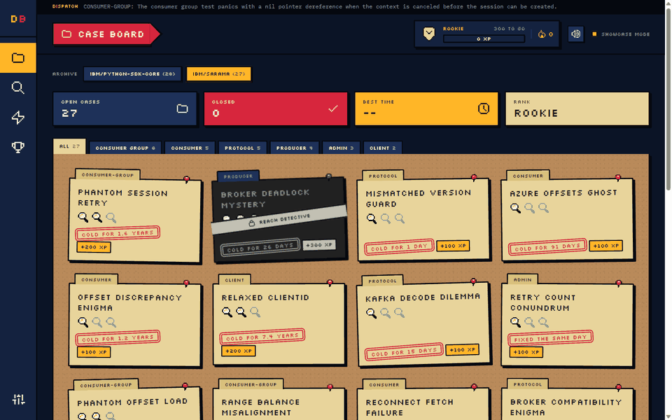
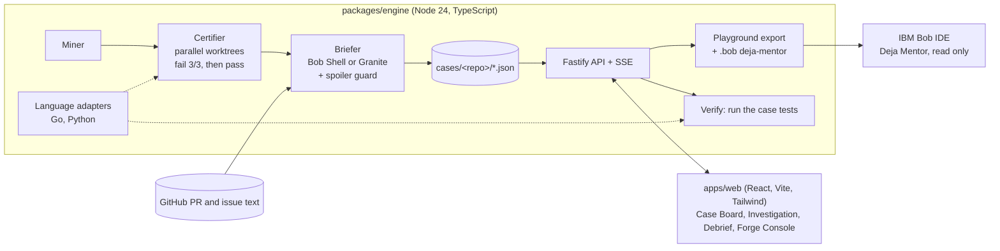

# DejaBug

> Pilots train on replays of real incidents. Your new hires train on your team's real bugs.

DejaBug mines a repository's git history for real bug fixes, proves each one with its own test (fails 3 times before the fix, passes after it), and serves them as cold cases in a detective game. New hires debug the real bug in IBM Bob, coached by a read-only **Deja Mentor** mode that cannot write the fix for them.

Built with IBM Bob for the IBM Bob 2.0 Hackathon (lablab.ai, Sep 25-27 2026). MIT licensed.

**Play it now:** https://ahammadshawki8.github.io/DejaBug/ (static showcase: 55 real cases, runs replay real recorded results)



## The problem

- New engineers learn a codebase slowly, and the skill that matters most on a real team, debugging unfamiliar code, is the one they practice least.
- AI assistants can make this worse. In Anthropic's 2026 randomized study of developers learning a new library, the group that learned with AI scored lower on mastery, and the largest gap was in debugging. Developers who used AI to understand rather than to produce kept their learning.
- Every mature repository already holds an unused curriculum: hundreds of real bugs, each with a known fix and a test that proves it.

## What it does

1. **Mine.** Scan the history for fix commits that change tests plus 1 to 3 source files.
2. **Certify.** In parallel git worktrees, restore the code just before the fix, add the fix's own test, and require it to **fail 3 out of 3 times**, then **pass** on the real fix. Flaky, non-compiling and already-passing candidates are rejected with a reason.
3. **Brief.** IBM Bob (Bob Shell headless, custom `deja-forger` mode) or IBM Granite on watsonx.ai reads the PR and issue thread and writes a spoiler-free case file: symptoms, evidence, 3 tiered hints, difficulty, precinct and the lesson. A spoiler guard rejects any brief that leaks identifiers the fix introduced.
4. **Play.** The player takes the case and gets a clean playground (the buggy snapshot, no future history), opens it in Bob IDE with the Deja Mentor mode, finds the bug, and runs the tests from the web app.
5. **Debrief.** CASE CLOSED, XP and rank, badges, and a side-by-side comparison with the original team: your time against their days, your diff against their fix.

### Measured on real repositories

| Repository | Language | Commits | Fix-like | Runnable candidates | Certified | Cases |
|---|---|---|---|---|---|---|
| [IBM/sarama](https://github.com/IBM/sarama) | Go | 2,889 | 703 | 101 | 27 of 44 attempted | 27 |
| [IBM/python-sdk-core](https://github.com/IBM/python-sdk-core) | Python | 489 | 98 | 45 | 31 of 45 attempted | 28 |

It is repository-agnostic: a language adapter layer (Go and Python today) detects the language, finds and runs the tests, and classifies the results as pass, fail, hang (a reproduced deadlock), build error or no test. Connect any Go or Python repository with tests from Settings or the Forge Console, or with `dejabug init <owner/repo>`.

## How IBM Bob powers it

Bob is part of the product, not only the tool we built it with.

- **Runtime:** the briefer calls `bob run --format json --mode deja-forger` (Bob Shell headless) with the `forge-case` skill to turn PR and issue threads into case files.
- **Product feature:** every playground ships a `.bob/` folder with the `deja-mentor` custom mode, whose permissions are **read only**, and a Socratic `mentor` skill. The mentor can read the code and ask questions, but it cannot edit a file. [Recorded session](bob_sessions/).
- **Built with Bob:** Plan mode for the engine design, Agent mode for the certifier and its parallel pool, 4 parallel explore subagents to rank the cases, the design system and Case Board, the mentor mode, and a Bob code review of the engine (findings in [`docs/reviews/BOB-REVIEW.md`](docs/reviews/BOB-REVIEW.md), verified and applied in [`REVIEW-03`](docs/reviews/REVIEW-03.md)).
- **Evidence:** 12 Bob tasks, 37.37 of 40 Bobcoins, every task summary in [`bob_sessions/`](bob_sessions/) and logged in [`docs/BOB_USAGE_LOG.md`](docs/BOB_USAGE_LOG.md). Work done by Claude Code is listed there too.

## Architecture



- `packages/engine`: CLI (`doctor`, `init`, `mine`, `certify`, `brief`, `start`, `serve`, `export-showcase`) and the local game server. It only accepts requests from this machine.
- `apps/web`: the game. Pixel art, typewriter case files, stamps and synthesized sounds, with reduced-motion support.
- `cases/<repo>/`: certified cases, one JSON file each. Usernames, emails and local paths are stripped before anything is saved (checked in CI by `scripts/check-cases.mjs`).

## Run it locally

Requirements: Node 24+, git, and the toolchain of the repository you play (a current Go release for sarama, Python 3 with pytest for python-sdk-core).

```bash
git clone https://github.com/ahammadshawki8/DejaBug.git
cd DejaBug
npm install
cp .env.example .env              # optional: GITHUB_TOKEN, watsonx keys for new briefs

npm run dejabug -- init IBM/sarama   # clones the repo the 27 bundled cases come from
npm run dejabug -- doctor            # checks git, Go/Python, Bob Shell and watsonx
npm run dev                          # engine on :4317, web on http://localhost:5173
```

Open http://localhost:5173, pick a case, press **Take the case**, open the playground folder in IBM Bob IDE, switch to the **Deja Mentor** mode, and run the tests from the Investigation screen.

Forge cases for another repository:

```bash
npm run dejabug -- init <owner>/<name>
npm run dejabug -- --target <owner>/<name> mine
npm run dejabug -- --target <owner>/<name> certify --limit 20 --concurrency 4
npm run dejabug -- --target <owner>/<name> brief
```

Or use **Settings > Connect a repository** in the app, which runs the same pipeline with live progress in the Forge Console.

Tests: `npm test` (105 tests across the engine and the web app), `npm run lint`, `npm run typecheck`.

## Data

Demo cases come from MIT and Apache-2.0 licensed public repositories. See [`docs/DATA_SOURCES.md`](docs/DATA_SOURCES.md).

## License

[MIT](LICENSE)
